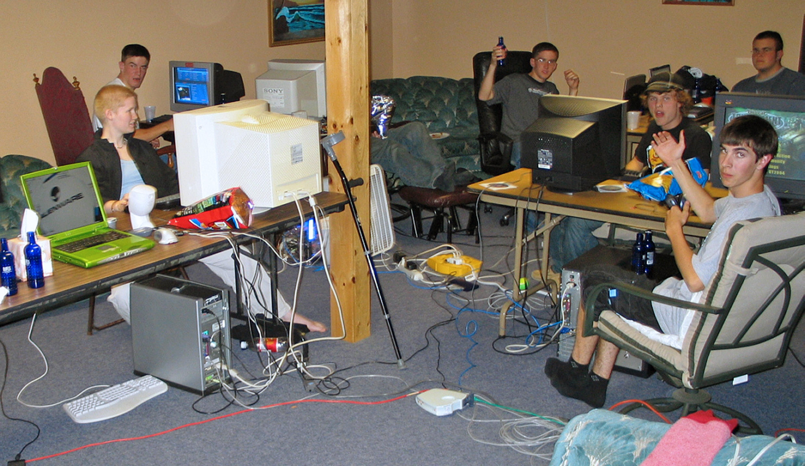

+++
title =  "Level 1: AAA (Animation, Art, Audio): Making Sense of Sound for Games"
outputs = ["Reveal"]
[reveal_hugo]
custom_theme = "reveal-hugo/themes/sunblind.css"
margin = 0.2
+++

## AAA (Animation, Art, Audio): Making Sense of Sound for Games

{}
Learning outcomes:

* Understand what makes audio for games unique across platforms
* Develop a current overview of hardware, OS, and middleware relevant to game audio
* Identify emergent behavior and map it to adaptive audio strategies
* Articulate platform-specific tradeoffs for mixing, routing, and performance
  {}

---

## Why game audio is different

* Real-time, non-linear systems: music and SFX respond to game state and player input
* Technical budgets: CPU, memory, streaming IO, voice counts, spatialization headroom
* Platform variability: APIs, device outputs, loudness targets, and certification rules

{}
Anchor non-linearity and emergence in the MDA framework: mechanics → dynamics → aesthetics. Prompt: how does audio map to each layer?
{}

---

## What's a platform?

{}
A platform combines hardware, OS/runtime, and store/QA rules. All three constrain scheduling, file formats, and output modes for audio.
{}

---

## Arcade

<iframe width="560" height="315" src="https://www.youtube.com/embed/CJYn62q_fq4?start=210" title="YouTube video player" frameborder="0" allow="accelerometer; autoplay; clipboard-write; encrypted-media; gyroscope; picture-in-picture; web-share" allowfullscreen></iframe>

More links: [International Arcade Museum](https://www.arcade-museum.com/) · [MAME](https://www.mamedev.org/)

{}

* Origin as self-contained electronic devices in cabinets, typically one game per unit
* Fixed hardware profile simplifies audio QA; mono/stereo, no OS mixer
* Peak popularity in the 1980s; still produced in niche markets
* Discussion: where does emergence show up in an arcade title’s soundscape?
  {}

---

## Console

* Generational hardware with strong middleware support (FMOD, Wwise)
* Living-room context drives output choices and target loudness; certification influences mix and output modes
* Devkits matter for validating device routing, controller headset paths, and compliance checks

See: [Retro Consoles Wiki](https://retroconsoles.fandom.com/wiki/Retro_Consoles_Wiki) · [webЯcade](https://play.webrcade.com/)
More links: [FMOD Studio docs](https://fmod.com/docs/2.02/studio/) · [Wwise platforms overview](https://www.audiokinetic.com/library/edge/?source=Help&id=platforms) · [XAudio2 (Microsoft)](https://learn.microsoft.com/en-us/windows/win32/xaudio2/xaudio2-introduction) · [Dolby Atmos for Xbox](https://support.xbox.com/help/hardware-network/accessories/dolby-atmos-on-xbox-one)

{}
Contrast arcade vs. console experiences; broaden the idea of "next-gen" to include SSD streaming and 3D audio pipelines. Tie certification checklists to audio deliverables.
{}

---

## PC in 2025: Windows, macOS, Linux

* Windows remains the broadest target; plan device-routing tests (WASAPI/XAudio/ASIO)
* macOS (Apple silicon): ports increasingly arrive via modern tooling; verify device routing and plugin behavior
* Linux/SteamOS: many Windows titles run via Proton; validate controller/headset paths and any middleware conditionals

Further reading: [Steam Hardware & Software Survey](https://store.steampowered.com/hwsurvey/Steam-Hardware-Software-Survey-Welcome-to-Steam) · [Proton](https://github.com/ValveSoftware/Proton) · [Apple Game Porting Toolkit](https://developer.apple.com/games/game-porting-toolkit/)
More links: [WASAPI/Core Audio APIs](https://learn.microsoft.com/en-us/windows/win32/coreaudio/core-audio-apis-in-windows) · [ASIO (Steinberg)](https://www.steinberg.net/asio/) · [Core Audio (Apple)](https://developer.apple.com/documentation/coreaudio) · [PipeWire](https://pipewire.org/) · [JACK Audio](https://jackaudio.org/)

{}
Quick matrix: Windows (WASAPI/XAudio), macOS (Core Audio), Linux (PipeWire/JACK). Show a contemporary OS share snapshot and discuss what it means for QA scope.
{}

---

## Handheld

<iframe width="560" height="315" src="https://www.youtube.com/embed/ARPlTqdVnkM?start=235" title="YouTube video player" frameborder="0" allow="accelerometer; autoplay; clipboard-write; encrypted-media; gyroscope; picture-in-picture; web-share" allowfullscreen></iframe>

* From Game Boy to modern handheld PCs
* Same middleware as PC, different constraints: battery/thermal budgets, smaller speakers
* Budget CPU for HRTF/spatialization; plan a "handheld mix" profile

Also try: [webЯcade](https://play.webrcade.com/)
More links: [Steam Deck](https://store.steampowered.com/steamdeck) · [SteamOS](https://store.steampowered.com/steamos) · [Game Boy sound (Pan Docs)](https://gbdev.io/pandocs/Audio.html?highlight=audio#audio-overview)

{}
Have students list three changes they would make moving a PC mix to a handheld device. Consider bass management and dynamic range.
{}

---

## Mobile

* iOS and Android dominate; audio stacks include AVAudioEngine/Core Audio and AAudio/Oboe
* Fragmentation: test on speakers and common earbuds; consider Bluetooth latency
* Use mobile-specific EQ/DRC and format choices to protect intelligibility on phone speakers

More links: [AVAudioEngine](https://developer.apple.com/documentation/avfaudio/avaudioengine)  · [Android Oboe](https://github.com/google/oboe) · [AAudio](https://developer.android.com/ndk/guides/audio/aaudio/aaudio) 
{}
Ask: what mix moves improve audibility on phone speakers? Consider high-pass filters, upward compression, and mono-compatibility.
{}

---

## Web-based games

* Early multiplatform gaming with engines offering consistent visual interfaces
* Flash is discontinued; modern web games use HTML5, WebAudio, WebAssembly, and increasingly WebGPU
* Engine exports (Unity WebGL, Godot HTML5) have audio feature gaps vs. native builds
* Native-web stacks: Phaser or PlayCanvas for rendering, with howler.js or Tone.js for direct control of WebAudio
* Example archive: [Flash Museum – Flash Games Online for Free](https://flashmuseum.org/)

See also: [Web Audio API (MDN)](https://developer.mozilla.org/en-US/docs/Web/API/Web_Audio_API) · [AudioWorklet](https://developer.mozilla.org/en-US/docs/Web/API/AudioWorklet) · [WebAssembly](https://developer.mozilla.org/en-US/docs/WebAssembly) · [WebGPU](https://developer.mozilla.org/en-US/docs/Web/API/WebGPU_API) · [Unity WebGL audio](https://docs.unity3d.com/560/Documentation/Manual/webgl-audio.html) · [Godot export for web](https://docs.godotengine.org/en/latest/tutorials/export/exporting_for_web.html) · [Tone.js](https://tonejs.github.io/docs/) · [howler.js](https://howlerjs.com/) · [Phaser audio](https://docs.phaser.io/phaser/concepts/audio) · [PlayCanvas audio](https://developer.playcanvas.com/tutorials/basic-audio/)

{}
Call out practical constraints: threading, sample-rate control, spatialization limits, and user-gesture requirements for audio start.
{}

---

## Cloud/streaming as a platform

* Audio is encoded/decoded in the stream; plan headroom and transient handling
* Latency is network-bound; design UI and audio feedback tolerant of added delay
* Test loudness and intelligibility across common streaming clients

More links: [Opus codec](https://opus-codec.org/) · [WebRTC](https://webrtc.org/) · [Cloud gaming (overview)](https://en.wikipedia.org/wiki/Cloud_gaming)

{}
Activity: take a fast UI sound set and iterate to reduce clickiness and masking when encoded at low bitrates.
{}

---

## XR/VR snapshot

* Object and ambisonic workflows; HRTF spatialization is the default
* Geometry-driven acoustics (occlusion, reflections, reverb) via SDKs
* CPU budgeting: plan voice counts; decide baking vs. real-time

More links: [Steam Audio](https://valvesoftware.github.io/steam-audio/) · [Meta XR Audio SDK](https://developers.meta.com/horizon/documentation/unity/meta-xr-audio-sdk-unity/) · [Microsoft Spatial Sound](https://www.microsoft.com/en-us/research/project/spatial-audio/) · [Resonance Audio](https://resonance-audio.github.io/resonance-audio/)

{}
Emphasize early planning for geometry tagging and reverb authoring workflows.
{}

---

## Narrativism and ludology

* Video games as stories: cyberdrama, interactive fiction, multi-path outcomes
* Video games as systems: rules, constraints, challenge navigation
* Modern practice balances authored narrative with system-driven moment-to-moment play

Further reading: [Ludology](https://en.wikipedia.org/wiki/Ludology) · [Narrative in video games](https://en.wikipedia.org/wiki/Narrative_in_video_games) · [Hamlet on the Holodeck](https://mitpress.mit.edu/9780262631877/hamlet-on-the-holodeck/) 

{}
Bridge with MDA and show how state drives adaptive music, stingers, and ducking. Have students map one mechanic to an audio parameter.
{}

---

## MDA framework (mechanics → dynamics → aesthetics)

* Mechanics: data and rules
* Dynamics: runtime behavior from player and system interaction
* Aesthetics: the emotional responses evoked in the player

More links: [MDA paper (PDF)](https://www.cs.northwestern.edu/~hunicke/MDA.pdf)

{}
- MDA helps bridge the gap between game design, development, and criticism by clarifying iterative processes.
- Mechanics are the rules and systems; Dynamics are the behaviors that emerge during play; Aesthetics are the emotional responses games evoke.
- Designers and players experience games differently, and changes in one layer affect the others.
- The framework supports formal, iterative design and tuning, enabling better control and understanding of player experience.
{}

---

## Emergence in games

<iframe width="560" height="315" src="https://www.youtube.com/embed/OrmyLaLCaIo" title="YouTube video player" frameborder="0" allow="accelerometer; autoplay; clipboard-write; encrypted-media; gyroscope; picture-in-picture; web-share" allowfullscreen></iframe>

More links: [Emergent gameplay](https://en.wikipedia.org/wiki/Emergent_gameplay) · [The Sound of No Man’s Sky (GDC)](https://www.gdcvault.com/play/1024067/The-Sound-of-No-Man)

{}
Too long to show fully in class. Prompt instead: identify one mechanic that could generate emergent audio (e.g., systemic weather + layered ambiences; AI director + adaptive music). Name two parameters you would expose to middleware to make it audible.
{}

---

## References and resources

* Design foundations
  * [MDA framework paper (PDF)](https://www.cs.northwestern.edu/~hunicke/MDA.pdf)
* Platform shifts and implications
  * [Apple Game Porting Toolkit](https://developer.apple.com/games/game-porting-toolkit/)
  * [WWDC guide (GPTK updates)](https://developer.apple.com/news/?id=ibe0jb52)
  * [Steam Hardware & Software Survey](https://store.steampowered.com/hwsurvey/Steam-Hardware-Software-Survey-Welcome-to-Steam)
  * [Proton (GitHub)](https://github.com/ValveSoftware/Proton)

---

Web audio stack

* [Web Audio API overview (MDN)](https://developer.mozilla.org/en-US/docs/Web/API/Web_Audio_API)
* [Using the Web Audio API (MDN)](https://developer.mozilla.org/en-US/docs/Web/API/Web_Audio_API/Using_Web_Audio_API)
* [WebGPU overview (MDN)](https://developer.mozilla.org/en-US/docs/Web/API/WebGPU_API)
* [Flash end of life (Adobe)](https://www.adobe.com/products/flashplayer/end-of-life-alternative.html)
* [Unity WebGL audio notes](https://docs.unity3d.com/560/Documentation/Manual/webgl-audio.html)
* [Godot export for web](https://docs.godotengine.org/en/latest/tutorials/export/exporting_for_web.html)
* [Phaser audio docs](https://docs.phaser.io/phaser/concepts/audio)
* [PlayCanvas audio basics](https://developer.playcanvas.com/tutorials/basic-audio/)
* [Tone.js docs](https://tonejs.github.io/docs/)
* [howler.js](https://howlerjs.com/)
* [MDN Game Dev hub](https://developer.mozilla.org/en-US/docs/Games)

---

Spatial and emergent audio

* [Steam Audio docs (Unity)](https://valvesoftware.github.io/steam-audio/doc/unity/guide.html)
* [Steam Audio C API docs](https://valvesoftware.github.io/steam-audio/doc/capi/index.html)
* [Meta XR Audio SDK overview](https://developers.meta.com/horizon/documentation/unity/meta-xr-audio-sdk-unity/)
* [Meta XR Audio SDK features](https://developers.meta.com/horizon/documentation/unity/meta-xr-audio-sdk-features/)
* [The Sound of No Man’s Sky (GDC talk)](https://www.gdcvault.com/play/1024067/The-Sound-of-No-Man)
* [Procedural audio Q&A (Paul Weir)](https://www.audiokinetic.com/en/blog/behind-the-sound-of-no-mans-sky-a-qa-with-paul-weir-on-procedural-audio/)
