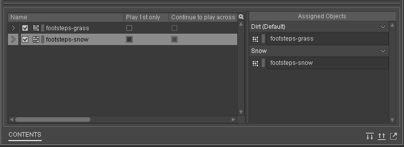
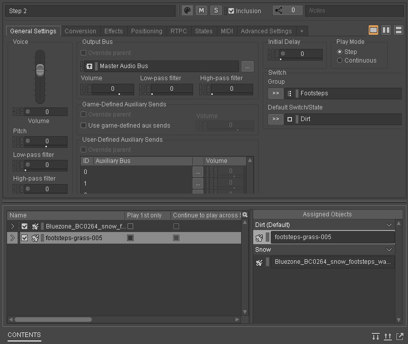

Source: [(104) Game Audio with Unity and Wwise Part 4: Random Containers, Switches and Basic Scripting - YouTube](https://www.youtube.com/watch?v=UH7OEm_g9Mg&list=PLzlEBXWjqM97U5rHMERc82sTXRBoSB_Fu&index=4)

> Before we start make sure you have Visual Studio installed.

We're starting to get a lot of sounds in our project. Let's organize with with a _Virtual Folder_. Put your sounds in a folder named _Box_. Do the same in the events tab.

## Footsteps

### Wwise

We'll now learn how to add realistic sounding footsteps to our environment. In order to play different footstep sounds on different surface types we'll use _Trigger Areas_.

> Download footsteps sounds [here](https://dakotastateuniversity-my.sharepoint.com/:f:/g/personal/tate_carson_dsu_edu/EmZiG00llDBNlGLEr2ratX0BdfE1MBd35rH4VwmO4TxflQ?e=QFpoKs)

Drag and drop this folder onto the Actor-Mixer Hierarchy. When importing set the parent folder to be a _Random Container_. Add this random container to a folder called _Footsteps_.

Call the random container _Footsteps Grass_. Go into the source editor for each sample and trim the start and end points to remove any silences.

To add more variations to our footsteps we can add random varations in pitch. In the general settings tab of the random container find the pitch section. Click on the little circle and open the _Randomizer_. Alter the min and max offset.

Create an event called _Play_Footsteps_Grass_ to play your random container. Add the event to your soundbank and export.

### Unity

To add these footstep sounds we'll need to start scripting. Go find the _FirstPersonController_ script on the _PlayerCapsule_ and open it.

Find the `private void Update()` function. This runs every frame of the game and is used for interactivity.

Now, find the `private void Move()` function then inside the function look for the lines below:

```c#
if (_input.move != Vector2.zero)
{
    // move
    inputDirection = transform.right * _input.move.x + transform.forward * _input.move.y;
}
```

This code allows our player to move.

We're going to add some code to allow Unity to call our Wwise event when the player moves. Add the code below to the headers section of the code above _Player Grounded_.

```c#
[Header("Wwise Events")]
public AK.Wwise.Event myFootstep;
```

Save the code and Unity should automatically recompile the project. You should be able to see the header on the script and some red text that says _No Event is currently selected_.

Go back to this section of the code:

```c#
if (_input.move != Vector2.zero)
{
    // move
    inputDirection = transform.right * _input.move.x + transform.forward * _input.move.y;
}
```

Add a new line like below to _Post_ an event to trigger the Wwise event when the player moves.

```c#
if (_input.move != Vector2.zero)
{
    // move
    inputDirection = transform.right * _input.move.x + transform.forward * _input.move.y;
    myFootstep.Post(gameObject);
}
```

Now, click on the red text and select your _Play_Footsteps_Grass_ event. You'll hear that too many footsteps are playing at the same time because we're playing an event for every frame that we're moving. We'll need to edit the code again to limit how often the footsteps are played.

Add these two variables under your Wwise Events header:

```c#
private bool footstepIsPlaying = false;
private float lastFootstepTime = 0;
```

Initialize `lastFootstepTime` in the `Awake()` function

```c#
lastFootstepTime = Time.time;
```

Finally, edit the code from the move function to match below:

```c#
if(!footstepIsPlaying)
{
    myFootstep.Post(gameObject);
    lastFootstepTime = Time.time;
    footstepIsPlaying = true;
} else
{
    if(_speed > 1)
    {
        if (Time.time - lastFootstepTime > 100 / _speed * Time.deltaTime)
        {
            footstepIsPlaying = false;
        }
    }
}
```

**Fix playing footsteps when jumping**

Add another private variable `private bool isJumping = false;`. Then add a check to your if statement to make sure your'e not playing footsteps while `isJumping` is false.

```c#
if(!footstepIsPlaying && !isJumping)

...
```

Then, set `isJumping` in the `JumpAndGravity()` function. Set `isJumping` to true in the if statement below:

```c#
// Jump
if (_input.jump && _jumpTimeoutDelta <= 0.0f)
{
    // the square root of H * -2 * G = how much velocity needed to reach desired height
    _verticalVelocity = Mathf.Sqrt(JumpHeight * -2f * Gravity);

    isJumping = true;
}
```

This handles the state from when we're grounded to when we're jumping. Then we need to reset our boolean variable so that it knows we're not jumping.

```c#
// Jump
if (_input.jump && _jumpTimeoutDelta <= 0.0f)
{
    // the square root of H * -2 * G = how much velocity needed to reach desired height
    _verticalVelocity = Mathf.Sqrt(JumpHeight * -2f * Gravity);

    isJumping = true;
} else
{
    isJumping = false;
}
```

But, what if we fall off of an object? We've never actually jumped, but we still don't want the possibility of footsteps sounding. To do this we can add a few lines to the previous if statement to set `isJumping` to false if we are not jumping. Go to the else statement of the `if(Grounded)` if statement and add the line `isJumping = true;`.

Test everything by trying to run while jumping and falling off of a building.

**Add Landing Sound**

To add more realism we'll add a landing sound. We'll create a landing sound in Wwise from two footstep sounds. Create a new event called `Landing` and add any two footsteps sounds to it. Delay one of the sounds a little. Add some randomization if you want. Export this event to your soundbank.

Create a new variable in your code called myLanding `public AK.Wwise.Event myLanding;`. Trigger the event when you're setting `isJumping` to false.

```c#
else
{
    if (isJumping)
    {
        myLanding.Post(gameObject);
    }
    isJumping = false;
}
```

Then attach your jumping event to the GameObject in Unity.

**Walking on some snow**

> Download these [snow sounds](https://dakotastateuniversity-my.sharepoint.com/:f:/g/personal/tate_carson_dsu_edu/ElqOPy4b8GREjbQsZ1F_wFkBi_qnju_TgsZm1XFNjiCqeg?e=c99854)

Create an empty game object in Unity called `Snow Field`. Inside it create a `Cube`. Reset both of the transforms to 0, 0, 0. Scale the `Cube` to 5, 0.2, 5. Move the `Snow Field` to the other side of the map. Add the `GridBlue` material to the `Cube` to make it look like "snow."

Add a `Box Collider` to the `Snow Field` and scale it to 5, 2.1, 5. Set the y position to 1. Check `isTrigger`.

Move back to Wwise to prepare the sounds. Add a new `Random Container` that contains your snow sounds in your `Footsteps` folder. Add some pitch randomization in the general settings tab of the `Random Container`.

Now we have two sets of footsteps that we'll trigger in Unity depending on what surface the player is walking on. We'll do with with a Switch game sync and a Switch group that contains both of the footstep `Random Container`s.

In the `Game Syncs` tab add a new `Switch Group` called `Footsteps`. Add two switches to the group called `Dirt` and `Snow`.

Back in the `Audio` tab add the `Random Containers` of footsteps to a `Switch Container` called `Footsteps`. Set the `Switch Group` of the `Switch Container` to `Footsteps` and set the default state to `Dirt`. Assign the `Random Containers` to the switches in the `Assigned Objects` section.

It will look like this:



You can now select the `Footsteps` container and audition the switches by changing them in the `Transport Control` section of Wwise.

Create a new event called `Play_Footsteps` to trigger the `Footsteps` switch container and delete the old `Play_Footsteps_Dirt` event that we don't need anymore. Make sure to add the new event to your soundbank before you export.

In Unity connect your new event to the empty variable.

To switch back to the dirt footsteps add another `AKSwitch` component and set it to switch to `Dirt` on `AKTriggerExit`.

Add a `AK Switch` to `Snow Field`, trigger on enter, and connect it to the snow switch. Check `Use Other Object`.

Finally, add an `AK Trigger Enter` component to make sure that only the player can trigger this switch.

**Fix landing on snow bug**

To do this create two new `Switch Containers` `Step 1` and `Step 2`. In each container add one dirt and one snow footstep. Assign the `Switch Group` to `Footsteps` then assign each sound to it's corresponding `Switch`.



Finally add these `Switch Containers` to the `Play_Landing` event and delay one of them. Play the event and test that the switches are happening correctly by using hte `Transport Control` section.

Add your event to the soundbank and test in Unity. Make sure to connect your event in Unity.
