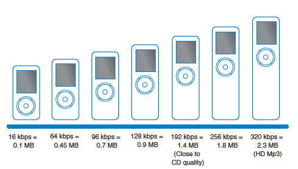

+++
title =  "Level 5: Bleeps, Blops, Clicks, and Pops: Sound Design in Games"
outputs = ["Reveal"]
[reveal_hugo]
custom_theme = "reveal-hugo/themes/sunblind.css"
margin = 0.2
+++

# Bleeps, Blops, Clicks, and Pops

## Sound Design in Games

---

## Learning Outcomes:

- Understand the workflow associated with sound design for games
- Learn the role of the sound designer in games
- Know the difference between interactive and adaptive audio

---

# The History of Sound Design

- Craft of sound had beginnings in the use of sound to underscore dramatic actions in theater
  - Elizabethan plays
  - Japanese Kabuki
- Luigi Russolo’s Intonarumori was a mechanical sound making device used
- Thomas Edison’s phonograph could record and playback sound

{}
From Italian composer Luigi Russolo’s fantastical mechanical sound- making devices called intonarumori in 1913, to the rise in popularity of radio and real time sound effects to enhance the drama in live theatrical productions, the creative use of sound became an integral part of the mystique of the middle of the twentieth century.

These first few sound creating devices could only produce live sound, but it was with the phonograph that sound could finally be played back after its creation. We could really "design" sound.

In the game design industry, the term **sound designer** may mean many things. The sound designer may only create sound effects, or may also integrate the audio into the final product.
{}

---

## Mike Patton plays the Intonarumori

<iframe width="560" height="315" src="https://www.youtube.com/embed/lrfCq71EfNU" title="YouTube video player" frameborder="0" allow="accelerometer; autoplay; clipboard-write; encrypted-media; gyroscope; picture-in-picture; web-share" allowfullscreen></iframe>

---

# Diegetic Sound

- Sound from sources that are visible on the screen or implied to be present
- Examples:
  - Character voices
  - Sounds from objects on screen
  - Music from musical instruments shown in the game

---

# Non-Diegetic Sound

- Sound from sources that are neither visible on the screen\, nor present in the action
- Examples:
  - The voice of the narrator
  - A sound effect that is added for dramatic effect
  - The music soundtrack

---

## Adaptive audio

<iframe width="560" height="315" src="https://www.youtube.com/embed/p-FLWabby4Y" title="YouTube video player" frameborder="0" allow="accelerometer; autoplay; clipboard-write; encrypted-media; gyroscope; picture-in-picture; web-share" allowfullscreen></iframe>

---

# Sound Effects Layers

- Background ambiance – environmental audio that sets the mood
- Foreground sounds – individual sounds that occur when a character moves or encounters objects
- Interface sounds – sounds attributed to the game interface

{}
What would examples of these sounds be that are diegetic and non-diegetic?

An example of diegetic background ambience might be the sound of water if the character were near water. A non-diegetic background ambience might be spooky noises in a haunted house.

Diegetic foreground sounds might include laser blasts or impact
sounds when a character encounters an object. A non-diegetic foreground sound might be an announcement over a public address system to warn of an intruder, or a power-up associated with an object but not otherwise related to on-screen action.
{}

---

## Adventure Games - The Longest Journey

<iframe width="560" height="315" src="https://www.youtube.com/embed/u3D8duGRtww" title="YouTube video player" frameborder="0" allow="accelerometer; autoplay; clipboard-write; encrypted-media; gyroscope; picture-in-picture; web-share" allowfullscreen></iframe>

{}
Let's do an analysis of this. What are the diegetic and non-diegetic sounds for background, foreground and interface sounds?

We can also pick another game.
{}

---

# Formats for Sound Files

- Proprietary and Open\-Source formats
- Interleaving
  - WAV \- Standard audio file format used natively in Windows PCs for uncompressed \(PCM\) sound files
  - AIFF \- Standard audio file format used natively in Macintosh computers for uncompressed \(PCM\) sound files

---

# Open, Compressed Audio Formats

- MP3 (MPEG Layer 3)
- Ogg Vorbis – open\-source container forma supports many codecs
- FLAC – a loss compression codec

---

# Proprietary Audio File Formats

- WMA \- \(Windows Media Audio\) owned by Microsoft and is Microsoft’s closed source alternative to MP3
- AAC – advanced audio coding based on MPEG4 audio standard owned by Dolby
  - A copy\-protected version developed by Apple is used in iTunes Music Store

---

# Range of MP3 Bit Rates

---

# Other Formats

- \.AU \- standard audio fi le format used by Sun’s version of Unix and Java
- \.CAF Core Audio Format \- Apple\-based format for audio files in Logic Pro and used prominently in iOS for seamless looping
- \.BWF \- Broadcast Wave Format is a new version of WAV files supported by PCs and used in the Pro industry
- \.SD2 \- now obsolete Sound Designer 2 format
- \.MID is the extension for a MIDI file\, a communication protocol for electronic instruments to speak with each other

---

# Birth of Sound Design in a Game

- Answer the following questions when preparing for your first gig:
  - What kind of game is this?
  - What is the target audience for this game?
  - What is the pace of the game?
  - What platform is the game being developed for?
  - What is the audio budget for the game\, how big can the files be?
  - What is the hardware space budget of this game?

---

# The Asset List

- Contains the complete list of every sound that will occur in the game
- Contains
  - Name of the sound broken out by type \(i\.e\. music\, sound effect or voice over
  - Standardized file naming conventions
  - Description of the function of the sound
  - Indication of looping or one\-shot trigger

---

# Where do Sounds Come From?

- Natural and unnatural sounds
- Industry\-Standard Sound Effects libraries
  - Sound Ideas\, Hollywood Edge
- Downloadable Sound Effects Libraries
  - The Game Creators\, Sound Dogs\, Sound Ranger
- Free Sound\-Effects Libraries
  - Free SFX\, FreeSound\, FindSounds

---

# Editing Technique

- One Shot
- Looping
- Equalization
- Compression
- Delay
- Reverberation
- Sound Layering
- 3D Sound

---

# Creating Your Own Sounds

- A creative process with many solutions
- Consider every sound in relation to the visual action
- Edit and record your own custom sounds when possible

---

# Meet the Team

- Audio Director \- usually directs those teams as they work on multiple titles simultaneously
- Audio Lead \- coordinates all the audio for a single game title
- Sound Designer \- creates sounds of all types for games using digital audio workstations and other sound\-editing programs to blend natural and electronic sounds
- Audio Programmer \- works with a game engine\, middleware\, and other production tools to integrate all sounds into the game
