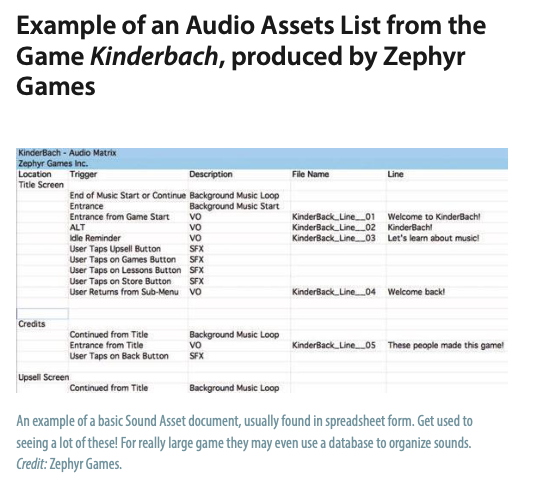

+++
title =  "Level 5: Bleeps, Blops, Clicks, and Pops: Sound Design in Games"
outputs = ["Reveal"]
[reveal_hugo]
custom_theme = "reveal-hugo/themes/sunblind.css"
margin = 0.2
+++

# Bleeps, Blops, Clicks, and Pops

## Sound Design in Games

---

## Learning Outcomes:

- Understand the workflow associated with sound design for games
- Learn the role of the sound designer in games
- Know the difference between interactive and adaptive audio

---

## The Evolution of Sound Design

- The role of sound in expressing emotions and moods
- Early sound effects in theater
- Advancements in sound recording and storage
- The significance of sound design in gaming

{}

- Sound has always been a crucial element in expressing emotions and setting moods, especially within the dramatic arts. It plays a vital role in shaping the audience's experience.
- Historical forms of theater, such as Elizabethan plays and Japanese Kabuki, utilized rudimentary sound effects like a metal sheet to mimic thunder, marking the early days of sound design.
- The development of recording technology, from Thomas Edison’s phonograph to modern digital workstations, revolutionized the way sounds are captured, stored, and reused, allowing for a vast library of sounds available for various productions.
- In the realm of game design, sound fundamentally alters the player's perception, with the role of a sound designer encompassing not just the creation of sound effects but also their integration into the final product, highlighting the multidimensional impact of sound in enhancing the gaming experience.

{}

---

## Mike Patton plays the Intonarumori

<iframe width="560" height="315" src="https://www.youtube.com/embed/lrfCq71EfNU" title="YouTube video player" frameborder="0" allow="accelerometer; autoplay; clipboard-write; encrypted-media; gyroscope; picture-in-picture; web-share" allowfullscreen></iframe>

---

## The Art of Foley and Sound in Film

- Introduction to Foley in film
- The non-linear nature of sound in games
- The role of game sound designers

{}

- Foley, named after Jack Foley, is a craft in film where sound effects are created in real time to match the on-screen action, bringing life to movies with meticulously timed audio.
- Unlike films, games offer a non-linear experience, requiring sound designers to prepare a dynamic range of sounds, ready to be triggered at any moment due to the unpredictable nature of gameplay.
- Game sound designers meticulously organize music, sound effects, and voice-overs as separate entities in a database, ready to be called upon when specific in-game events occur, showcasing the complexity and interactive nature of sound design in gaming.

{}

---

## The Complexity of Sound in Gaming Platforms

- Pre-mixing sounds in simple gaming platforms
- Advanced audio mixing in sophisticated gaming systems
- The continuous evolution of game sound design

{}

- In basic gaming platforms like most mobile and social games, sounds must be pre-mixed and balanced before being triggered, ensuring consistency and quality.
- More complex platforms, such as console games, feature advanced audio engines that mix sounds in real-time, responding to the player's actions, acting like virtual Foley artists by adding effects as the game progresses.
- The varying specifications of different gaming platforms present unique challenges, pushing sound designers to constantly innovate and adapt, ensuring that audio quality and integration evolve with the advancing technology.

{}

---

## Understanding Diegetic and Non-Diegetic Sounds in Games

- Definition and examples of diegetic sound
- Definition and examples of non-diegetic sound
- The dynamic nature of interactive and adaptive audio in games

{}

- Diegetic sound refers to audio that originates from the game's world itself, such as character voices, object sounds, or in-game music, enhancing the player's immersion by grounding audio elements in the game's reality.
- Non-diegetic sound, on the other hand, includes audio elements like narrators' voices or background music that are not part of the game's world but are added for dramatic effect or storytelling, guiding the player's emotional response.
- The interplay of interactive and adaptive audio in games creates a dynamic and responsive audio environment, with sounds changing in reaction to the player's actions or in-game factors, illustrating the intricate layering and responsiveness of sound design in gaming.

{}

------

## Adaptive audio

<iframe width="560" height="315" src="https://www.youtube.com/embed/p-FLWabby4Y" title="YouTube video player" frameborder="0" allow="accelerometer; autoplay; clipboard-write; encrypted-media; gyroscope; picture-in-picture; web-share" allowfullscreen></iframe>

---

## Layered Sound Effects in Gaming

- Subcategories of game sounds: Background ambience, Foreground sounds, Interface sounds
- Role and examples of each category
- Interaction between sound categories and gameplay

{}

- In gaming, sound effects are meticulously categorized into subcategories like background ambience, foreground sounds, and interface sounds, each serving a unique purpose in enhancing the gaming experience.
- Background ambience sets the environmental mood, such as the sound of water near a character, while foreground sounds are directly tied to in-game actions, like laser blasts or collision noises. Interface sounds are linked to the game's UI, providing feedback on player actions or changes in game status.
- The interplay between these sound layers creates a rich, immersive audio landscape, dynamically responding to and influencing player interactions and the overall narrative flow of the game.

{}

---

## Exercise: 

Let's pick a game from last week and analyze the sound design. What are the different layers of sound? How do they interact with the gameplay? Diegetic vs non-diegetic? Adaptive? Layered?

---

## Sound File Formats 

- Types of sound file formats: Open, Uncompressed, and Proprietary
- Characteristics of uncompressed audio: PCM, bit depth, sample rate
- Concepts of interleaving in audio files

{}

- Sound files in gaming vary widely, with some platforms preferring proprietary formats and others opting for open standards like Ogg Vorbis, highlighting the diverse technical landscape of audio in gaming.
- Uncompressed audio formats, like WAV and AIFF, use linear pulse-code modulation (PCM) to deliver high-quality audio, with the fidelity hinging on factors such as bit depth and sample rate, exemplifying the intricate technical considerations in sound design.
- The concept of interleaving in audio files, whether dealing with stereo (interleaved) or multi-mono (non-interleaved) configurations, plays a crucial role in how sound channels are managed and delivered within a game, impacting the overall audio experience.

{}

---

## Compressed Audio File Formats 

- Overview of compressed audio file formats
- Auditory masking and perceptual limits in audio compression
- Characteristics and usage of MP3, Ogg, and FLAC formats

{}

- Compressed audio formats, including MP3, Ogg, and FLAC, are pivotal in gaming, balancing the trade-off between audio quality and file size, crucial for efficient game performance and storage.
- Techniques like auditory masking allow these formats to omit sounds beyond human perceptual limits, optimizing file size without noticeably compromising audio quality, demonstrating the ingenious application of psychoacoustic principles in audio design.
- Each format brings its nuances: MP3's popularity is tempered by its challenges in looping audio smoothly, Ogg offers quality comparable to MP3 but with limited support on platforms like Apple devices, and FLAC stands out for its lossless compression, guaranteeing a perfect replication of the original audio upon decompression, highlighting the diverse toolkit available to sound designers in gaming.

{}

---

# Range of MP3 Bit Rates

---

## Proprietary Audio File Formats 

- Introduction to proprietary audio formats: WMA, AAC, and others
- Specifics and applications of each format
- Understanding the unique characteristics and usage scenarios

{}

- Proprietary audio formats like WMA, AAC, and others offer unique characteristics and benefits, tailored to specific platforms or requirements, showcasing the varied landscape of audio options in gaming.
- WMA, Microsoft's alternative to MP3, and AAC, Dolby's format widely used in Apple's ecosystem, exemplify how major tech companies have developed their own audio standards to optimize performance and integration within their platforms.
- Additional formats like .AU, .CAF, .BWF, .SD2, and .MID each serve specific functions, from seamless looping in iOS (CAF) to professional broadcasting standards (BWF), and even communication protocols for electronic instruments (MIDI), highlighting the broad spectrum of audio solutions tailored to various technical and creative needs in gaming and beyond.

{}

---

# Other Formats

- \.AU \- standard audio fi le format used by Sun’s version of Unix and Java
- \.CAF Core Audio Format \- Apple\-based format for audio files in Logic Pro and used prominently in iOS for seamless looping
- \.BWF \- Broadcast Wave Format is a new version of WAV files supported by PCs and used in the Pro industry
- \.SD2 \- now obsolete Sound Designer 2 format
- \.MID is the extension for a MIDI file\, a communication protocol for electronic instruments to speak with each other

---

## Preparing for Your First Sound Design Project in Gaming

- Understanding the game's context and audience
- Assessing technical and creative requirements
- Importance of preliminary information gathering

{}

- Embarking on your first sound design project in gaming involves a deep dive into understanding the game's genre, target audience, and pace, ensuring that your sound design aligns perfectly with the game's thematic and demographic considerations.
- Technical aspects like the development platform and audio budget are crucial, affecting everything from the sound file formats you choose to the overall quality and quantity of audio assets you can integrate, highlighting the necessity of a meticulous, informed approach.
- Gathering detailed information from game designers, producers, or programmers is indispensable, as it lays the groundwork for making informed creative decisions and ensuring your sound assets enhance the game's immersive experience without exceeding technical limitations.

{}

---

## Crafting the Audio Assets List 

- Importance of the audio assets list
- Key components of each audio asset entry
- Organizational strategies for efficient soundtracking

{}

- The audio assets list serves as the cornerstone of your sound design project, acting as a comprehensive inventory of all sound elements and a guide to keep the project on track throughout the development process.
- Each entry in the audio assets list should meticulously detail the sound's name, standardized file name, function within the game (like ambiance, effects, or dialogue), and playback nature (looping or one-shot), ensuring clarity and ease of integration.
- While some companies may utilize sophisticated asset management systems, the responsibility often falls on the sound designer to initiate, compile, and maintain this list, emphasizing the importance of a methodical, organized approach to sound asset tracking in gaming projects.

{}

---

---

## Sourcing and Crafting Sounds 

- Origin and evolution of sound sourcing
- Role of industry-standard and downloadable sound-effects libraries
- Techniques for customizing and integrating sounds in games

{}

- Historically, sound designers would record natural or synthesized sounds directly for their projects. However, the advent of CDs and the internet revolutionized this process, introducing extensive, readily accessible sound-effect libraries.
- Renowned libraries like Sound Ideas and Hollywood Edge set industry standards, providing a vast array of sounds, though modern sound designers often customize these to avoid generic outputs. Meanwhile, online platforms have emerged, offering both paid and free collections, expanding access but necessitating careful quality and licensing considerations.
- Once sourced, sounds are intricately edited and layered using digital audio workstations (DAWs), allowing designers to craft unique auditory landscapes. This process, fundamental in game design, ranges from simple sound insertions to the complex manipulation of thousands of audio files, underscoring the creative and technical prowess required in game sound design.

{}

---

## Key Roles in Game Sound Design Teams

- Overview of team structure and role specialization
- Responsibilities of Audio Directors, Audio Leads, and Sound Designers
- The critical role of Audio Programmers in sound integration

{}

- The sound design team in game development can vary from a single multifaceted individual in small companies to specialized roles in larger teams, each contributing unique skills and expertise to the auditory aspect of the game.
- The Audio Director orchestrates the entire audio vision, managing resources and personnel while collaborating closely with game designers to ensure a cohesive sound strategy. The Audio Lead, often synonymous with the Audio Director in smaller setups, focuses on the audio components of a single game, liaising regularly with other team members.
- Sound Designers are the creatives behind the game's auditory elements, skillfully blending natural and synthesized sounds, and sometimes even integrating these sounds into the game using specialized tools. Audio Programmers, although not typically sound designers, play a crucial role in embedding the audio seamlessly into the game environment, utilizing their coding expertise and deep understanding of audio systems and hardware.

{}

---

## Conclusion: The Multifaceted World of Game Sound Design

- Complexity and creativity in game sound design
- Dynamic nature of sound in games versus static media
- Importance of technical knowledge and adaptability

{}

- Sound design in games is a rich and complex field that balances creative artistry with technical acumen, requiring a deep understanding of both sound creation and the dynamic, interactive nature of the gaming environment.
- Unlike the linear soundscapes of film or TV, game audio must be adaptable and responsive, ready to change with each player's action or game scenario, showcasing the unique challenges and opportunities in crafting immersive and engaging sound design for games.
- The role of a game audio designer extends beyond sound creation, encompassing meticulous asset management and a keen awareness of evolving software and hardware landscapes, making it a field where technical expertise, constant learning, and creative innovation are not just valuable but essential.

{}
