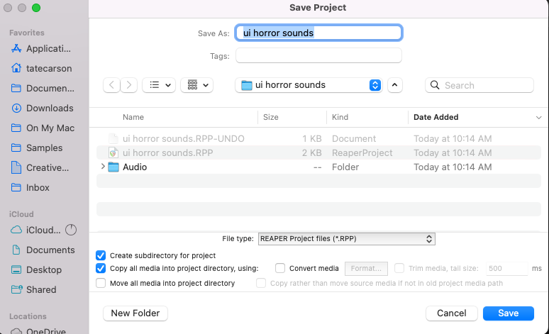

> The following tutorial is based on this video: [How to make Haunting Horror Sound Effects for UI / interfaces (includes free sounds!) - YouTube](https://www.youtube.com/watch?v=XqadaqdKBEQ)

If you're on Windows, replace _command_ with _control_ for the keyboard shortcuts.

## Project Setup

First, download the 15 free horror sound effects that we'll use in this tutorial and the video use for sound design.

- [Sounds](ASFX%20-%20Sound%20Spark%20Horror%20Sound%20Freebies.zip)
- [Video](horror-ui-video.mp4)

Next, open up Reaper and create a new project. Save it with the following settings for proper file management:

Open the _media explorer (cmd + shift + m)_, then select the project directory. Add the sounds you just downloaded here. Now our source files are easy to find and manipulate.

Add the video to a new track and duplicate that track. Name the first track _ui video_, and the second _ui audio_. We'll take the first track out of the master parent send, so that it doesn't make sound but still let's us see the video. The second track we'll use for listening to the previous sound design. We can mute and unmute the audio on this track without muting the video. Press Cmd + Shift + V to show the video window.

## Design brief

As explained by Chase Steele in the video, this game doesn't have any voiceover, so the sounds of the UI have to do a lot of work to show the player what to do with the game.

## Ambience

I'm using the _SoundQ_ software to search Freesound and my other sounds. I recommend this application, but it isn't required for this class. I searched for "dark ambience" and picked a suitable ambience. I found another ambience that was a gong sample, it wasn't long enough so I stretched it out using Option + drag, then changed the time stretch mode to "reaaaaaaaa."

## Bio electrical sounds

I added some of the tape servo sounds to the "pickup and place key" action at the start of the video. One sound was time stretched with "reaaa" mode. The other was split into two, then the first half was time stretch to fill in silence. I wanted this first part to change pitch over time, so I added ReaPitch as a take FX (shift + E), so it only applies to this one item. I applied take automation to shift the cents change over time. Finally, these items were crossfaded.
