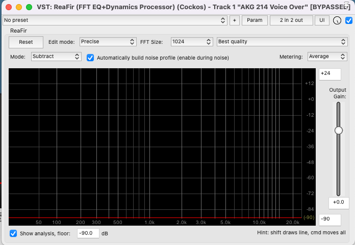
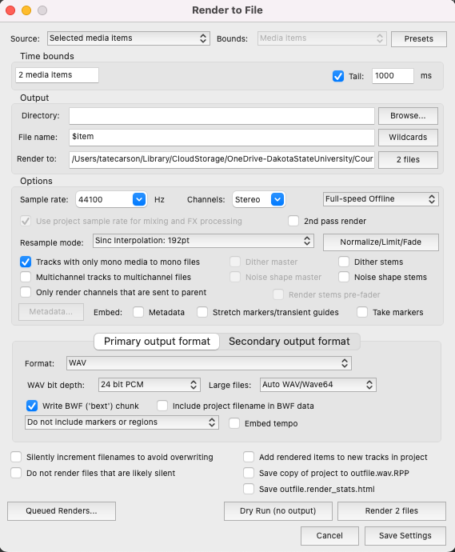

### Title: VO Editing

#### Reference Video
For a visual and detailed guide, refer to the video: [Recording and Processing Voiceover or Narration in REAPER](https://www.youtube.com/watch?v=eTNo3yrWGww).

#### Preparation
1. **Download Material**: Ensure you have downloaded [this VO](max-vo.wav) recording to follow along with the editing process in class.

### Noise Removal with ReaFir
1. **Add ReaFir Plugin**: In Reaper, add the ReaFir plugin to your track.
2. **Configure Plugin**: Refer to the provided settings image, and set up your ReaFir plugin accordingly.
   1. 
3. **Build Noise Profile**:
   1.  Select a part of the recording where only background noise is present (no vocals).
   2.  Play this part to allow ReaFir to analyze and build a noise profile.
   3.  Once the profile is built, uncheck the option "Automatically build noise profile."
4. **Apply Noise Reduction**: ReaFir will now use the built profile to remove the background noise throughout your recording.
5. **Review**: Carefully listen to the track to ensure that no unwanted artifacts have been introduced during the noise reduction process.

### Editing
1. **Split Tracks**: Divide your track into separate media items, each representing a line in the assets list.
2. **Add Fades**: 
    1. Add a fade-in at the start of each item. 
    1. Add a fade-out at the end of each item. 
    1. Ensure the option "Auto-crossfade media items when editing" is enabled in Reaper.
3. **Remove Clicky Noises**:
   1. Identify and remove mouth noises made by the VO artist.
   1. Use the action "Item: Split items at time selection" (Shortcut: Shift + S) for precision.
   1. Replace the removed segment with a silent part from the noise profile section used in ReaFir.
4. **Ripple Editing (Optional)**:
   1. Enable ripple editing if you need to remove a part of an item and adjust the timing.
   1. Use a razor edit (Option + Right-click drag) to select and remove the undesired part.
5. **Glue Items**: Once satisfied with the edits, glue the items back together to consolidate your changes and simplify the rendering process.

### Effects
1. **EQ**: Apply ReaEQ and configure a high pass filter to eliminate unnecessary low frequencies from the voice.
2. **Compression**: Add ReaComp, set a ratio of 4:1, and enable auto makeup gain.
3. **Multiband Compression**: Implement ReaXComp to compress each frequency range of the voice separately.
   - Set a 4:1 ratio for each band.
   - Activate "program dependent release."
   - Use "solo current band" for focused adjustments and set thresholds as needed.
4. **Limiter**: Incorporate ReaLimit and set a brickwall ceiling at -5 dB.
5. **Metering**: Place JS: Loudness Meter Peak/RMS/LUFS (Cockos) on your master track to monitor levels before exporting.

### Rendering
1. **Review Rendering Settings**:
   1. 
2. **Note on Mono Files**: Pay attention to the option _tracks with only mono media to mono files_. Use this to render mono tracks as mono files, saving storage space without compromising quality.

These step-by-step instructions are designed to guide you through the VO editing process in Reaper efficiently. For additional tips on removing mouth noises, you can watch [How To Remove Mouth Noises In Your Recordings](https://www.youtube.com/watch?v=r5ki_fo2rlk).

<!-- See this video for reference: [Recording and Processing Voiceover or Narration in REAPER](https://www.youtube.com/watch?v=eTNo3yrWGww)

Download [Max's VO](max-vo.wav) recording to edit with me in class.

After we record our voice over a few things need to be done to make sure our recording sound good and are edited properly.

## ReaFir

First, we'll remove any noise added during the recording process with ReaFir. Add the plugin with the following settings:

Make a time selection on a part of the recording with silence. Play the recording to build your noise profile. Then, uncheck "Automatically build noise profile." Now, ReaFir will filter out any unwanted noise from your VO Recordings.

Listen to the track to make sure you haven't added any unwanted artifacts.

## Editing

Now you can split your track into media items for each line you need for the assets list. Add fade ins at the start of the item and fade outs at the end.

Make sure _Options: Auto-crossfade media items when editing_ is on.

Max is making some clicky mouth noises. Let's try to find them and remove them. After removing them, replace them with silence from the part of the recording that you used for ReaFir noise suppression. One trick for this is the action _Item: Split items at time selection_ (Shift + S). This will make it easy to cut the right amount of silence to replace your mouth sound.

If you would like to remove part of an item and move it over in time you can enable **ripple editing** and select the part you want to remove with a razor edit (option + right click drag).

When you're happy with your edits, glue the items back together to remove any cuts. This will allow easy rendering.

Other editing tips: [How To Remove Mouth Noises In Your Recordings](https://www.youtube.com/watch?v=r5ki_fo2rlk)

## Effects

- EQ: Add a high pass filter with ReaEQ to cut out low end that isn't needed for the voice.
- Compression: Add ReaComp with a 4:1 ratio and auto-makeup gain.
- Multiband Compression: Add ReaXComp to do compress each frequency range of the voice separately. Use a 4:1 ratio on each band and select "[program dependent release](https://www.sweetwater.com/insync/program-dependent-release/)." Select "solo current band" and set the threshold on each band to your liking.
- Limiter: Add ReaLimit with a brickwall ceiling of -5 dB
- Meter: Add JS: Loudness Meter Peak/RMS/LUFS (Cockos) to your master, so that you can see what your levels are at before exporting.

## Extra rendering instructions

See the rendering settings below. Notice the checked parameter _tracks with only mono media to mono.files_. This setting allows us to render stereo and mono tracks depending on the channel count of the original media items. Rendering mono items as mono files saves storage space.

 -->
