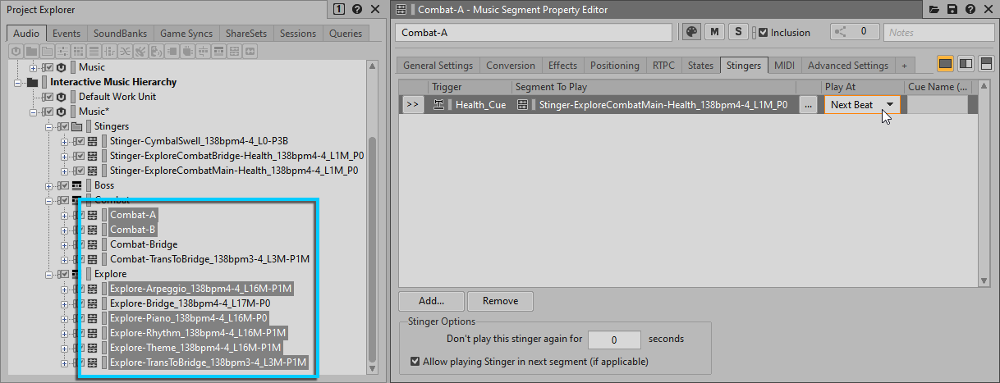
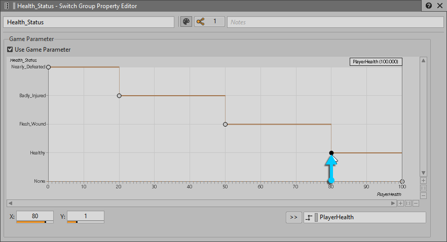

## Understanding Stingers

Stingers are sound effects that happen on beat with the music. We have to take special care to make sure that these events line up, since we can't know when a player will trigger them, and how that time will line up with the music.

We want our stingers to be shared between music playlists, so create a virtual folder in the root of the Music work unit and call it "Stingers". Import the cymbal swell stinger into this folder.

We want the loudest part of the swell to happen in time with the music. To allow this we'll move the entry cue to the largest part of the waveform. You may need to turn off snapping. Also move the exit cue to the same part.

This sound will be triggered using a "Trigger" game sync. Find the triggers folder in the game syncs tab and create a new work unit there called "Music". Add a child "Trigger" to this work unit called "Cymbal_Swell".

Find the "stingers" tab of the combat music playlist. Add the "Cymbal_Swell" trigger then drag the "Stinger-CymbalSwell_138bpm4-4_L0-P3B" segment under where it says "segment to play". Set it to play at "next bar".

Because the game engine is not sending a trigger called "Cymbal_Swell" we'll have the Teleport event call that trigger. Find the Teleport event and add a Trigger to its Event Property Editor. Now drag the "Cymbal_Swell" trigger to the empty target slot.

Repeat the previous steps to add the stinger to the Boss and Explore playlists.

To test our stinger we'll have to use the soundcaster. Open it with "shift + s". Create a new session called "Music Testing". Add the boss, combat, and explore playlists. Also add the Teleport event. Play each of the playlists then trigger the Transport event. Listen and check if the cymbal swell is happening directly on beat with the music.

Now add the other two stringers from the stingers music folder. These will be for the player health. Add a trigger called "Health_Cue" to the "Music" work unit in the game syncs tab. The health cues depend on the music that is currently playing so we have to configure this stinger a little differently from the cymbal swell.

Setup "Health_Cue" triggers that play the main health stinger for each of the highlighted segments below. Make sure to set "play at" to "next beat".

Add the bridge stinger to the remaining bridge segments.

We'll use the ItemHealth100 and ItemHealth200 Events to call the "Health_Cue" trigger. Find those events and assign the "Health_Cue" trigger to them by dragging it in from the game sync tab.

Test these by dragging the ItemHealth100 and ItemHealth200 Events into your soundcaster session. I had to turn the music down a lot to hear the health stinger.

## Using States

We'll now add some special sound design to the games "super gem" mode. Find the combat-a music segment. We'll change the arpeggio track so that it's only heard when the player is in super gem mode. Delete the empty sub-track.

With the "Combat-A-Arpeggio1" track selected, go to the states tab and add a state group for the state "PlayerHasSuperGem". Since we only want to hear the arp when the supergem mode is on turn the voice volume for the "no" state all the way down. Also make sure this change happens on the beat by setting "change occurs at" to "next bar".

Test it out by selecting the combat-a music segment. On the transport control set the PlayerHasSuperGem state to true. You should hear the arp track. Solo it if you need to.

Open the state group property editor by double-clicking on the PlayerHasSuperGem state group back on the combat-arp track. Change the default transition time to 0.1.

Repeat the same steps for the combat-b arp track in the combat-b music segment.

## Using Switch Sub-Tracks

We're going to use a switch so that as the wwizards health declines the electric guitar parts will become more intense.

Create a new Music work unit in the switches folder of the game syncs tab. Inside add a switch group called "Health_Status". Inside of the switch group add the following switches: Healthy, Flesh_Wound, Badly_Injured, and Nearly_Defeated.

Find the "Combat-A-Guitar" track and change it's playback mode to "switch". With the "general settings" tab selected add "Health_Status" to the "switch group" field and set the default state to "Healthy".

Back on the guitar track set the first sub-track to have a "Healthy" association by right clicking. Set the other sub-tracks to Flesh_Wound, Badly_Injured, and Nearly_Defeated in that order. Test it in the transport control by changing the switches to different settings.

If a switch is triggered currently we won't hear the guitar sound change until the end of the exit cue. This isn't fast enough to give feedback to the player. To fix this we can look at the transitions tab of the music track property editor. Currently you can see that its set to not transition until the next exit cue. Lets change this to "next bar". Play the music and check that it works.

Let's fade the transition to make it less abrupt. Click the box by "fade-out" and then edit. Set the fade time to 0.5. Now set the "fade-in" to 0.5 and an offset of -0.5 to make the fades more in time. Repeat the same steps for Combat Main B and combat bridge.

We now need to map the RTPC for health to our switch for health since the game does not communicate directly with the "Health_Status" switch. Click on the "Health_Status" switch group in the RTPC tab. Click the "use game parameters" checkbox. Add the PlayerHealth game parameter.

Adjust the graph to look like the following:

You can move the player health RTPC to the left or right of the switch group.

Now go get hit by the bad guys and hear your sounds change!
