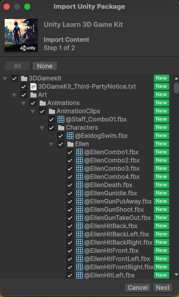
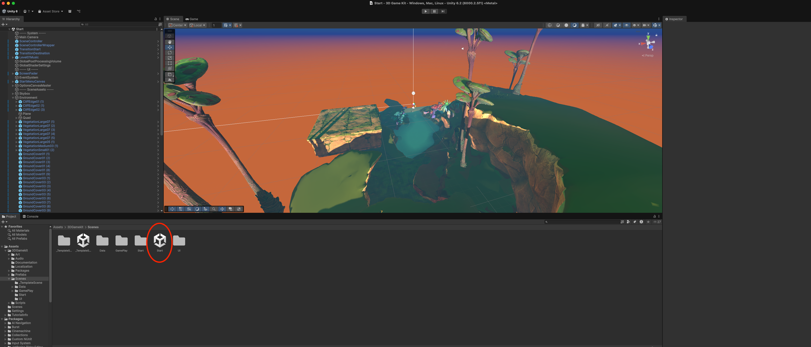

# Software Setup Instructions

## 1. Install Unity Hub

- Download and install Unity Hub from the [Unity website](https://unity.com/download).
  - Unity Hub is a management tool for Unity projects and installations.
  - It allows you to manage multiple Unity versions and projects easily.  
- When you open Unity Hub for the first time, you will need to create a Unity ID or log in.

## 2. Install Unity Editor

- Unity Hub should prompt you to install the current Unity Editor (Unity 6.2 for this course). Start the download as soon as possible—it can take a while.
- If the download does not start automatically, open the "Installs" tab, click "Install Editor," and pick the version listed above. Accept the default build support modules unless your instructor specifies otherwise.
  
## 3. Create a Unity Project

- In Unity Hub, go to the "Projects" tab.
- Create a project with the following settings: 

This will take a minute, so be patient.

## 4. Install the 3D Game Kit

- Open the Unity Asset Store in your web browser: [3D Game Kit](https://assetstore.unity.com/packages/templates/tutorials/3d-game-kit-115747).
- Click "Add to My Assets" and then "Open in Unity".
- This will open the Package Manager in Unity.
- Click "download" and then "import" to add the 3D Game Kit to your project.
- It's OK to overwrite any files if prompted.
- Install/update any dependencies if prompted.

When this window pops up click "Next" and then "Import".

The editor will take a minute to import all the assets and compile scripts.

## 5. Setting up the Scene

Finally, find the Project tab, then navigate to `Assets > 3DGameKit > Scenes` and double click on `Start` to open the scene.

*Open the image in a new tab to see it full size.*

To make the project more performant, go to `Edit > Project Settings > Quality` and set the quality to "Performance".

If you run into NavMesh compiler errors during import, see the troubleshooting note below.

### Troubleshooting: NavMesh package errors

Unity may throw compiler errors in `NavMeshLink.deprecated.cs` because older fields such as `autoUpdate` and `bidirectional` were removed from the latest AI Navigation package. Duplicate assembly-definition GUIDs can also appear when legacy and new NavMesh files are both present. Deleting the `Library/PackageCache/com.unity.ai.navigation` folder forces Unity to download a fresh copy of the package, clearing the missing symbol errors and GUID conflicts on the next compile.

Import TMP Essential Resources if prompted. If you miss this step, you can always go to `Window > TextMeshPro > Import TMP Essential Resources`.

## 6. Play the Scene

Now play the game! Click the play button at the top of the screen.

## 7. Prepare FMOD assets

This game ships with native Unity audio, but we will replace it with FMOD. Work through the following steps:

1. In Unity, go to `Edit > Project Settings > Audio` and **check** "Disable Unity Audio". This prevents the built-in AudioSource components from playing while you migrate to FMOD.
2. Download the FMOD project that already contains the 3D Game Kit audio assets. If you still need FMOD Studio, install it from the [FMOD website](https://www.fmod.com/download).
3. Extract the downloaded archive and open the project in FMOD Studio.
4. Immediately choose `File > Save As` to rename the project to something memorable and store it somewhere you'll be able to find later.

> [Download FMOD Project](3D-Game-Kit-FMOD-Project-BLANK-v2.00.00.zip)

## 8. Integrate FMOD with Unity

Download the FMOD for Unity integration package from either the [Unity Asset Store](https://assetstore.unity.com/packages/tools/audio/fmod-for-unity-161631) or the [FMOD website](https://www.fmod.com/download#integrations). The Asset Store workflow matches the 3D Game Kit import: add it to your assets, open it in Unity, then download and import through the Package Manager.

When Unity finishes importing, the FMOD Setup Wizard launches. Follow its prompts to:

- Point to the `.fspro` file for the project you saved in the previous step.
- Choose the platforms you plan to build (e.g., Desktop) so Unity knows which bank files to load.
- Let the wizard swap in an `FMOD Studio Listener` on the main camera and add any required `FMOD Studio Event Emitter` components.

After the wizard completes, double-check the following:

- Under the `FMOD` menu, open `Edit Settings` and confirm the project or bank path is correct.
- Remove any leftover `Audio Source` components that Unity might still have on prefabs you plan to control with FMOD.

In FMOD Studio, build the banks with `File > Build` (or press `F7`). Save the project to trigger Unity to refresh the banks. Unity should detect the new bank files automatically; if not, pick `FMOD > Refresh Banks` inside Unity.
