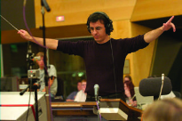

+++
title =  "Level 6 Compose Yourself!: The Art of Composing for Games"
outputs = ["Reveal"]
[reveal_hugo]
custom_theme = "reveal-hugo/themes/sunblind.css"
margin = 0.2
+++

## Level 6 Compose Yourself!: The Art of Composing for Games

---

# Learning Outcomes

- Identify differences between linear and non\-linear music composition
- Examine the use of loops\, branching\, and transitions
- Recognize the factors involved in non\-linear scoring
- Understand vertical and horizontal musical concepts

---

## Challenges in Music Creation for Media

- Music composition varies across mediums
- Unique challenges in theater, film, television, and games
- Specific issues faced by game composers
- Solutions and strategies for effective game music composition

{}

- Composers produce distinct music when creating freely versus composing for specific mediums like theater, film, television, or games, due to differing aesthetic principles and production requirements.
- Game music presents unique challenges, such as the open-ended nature of gameplay, requiring the music to adapt to unpredictable player actions and game durations.
- Game composers grapple with creating engaging music that remains fresh and non-repetitive, despite the player potentially spending extended periods in certain game areas or scenarios.
- Effective solutions include composing modular music that can be reassembled in various ways to suit different game scenarios, addressing the dynamic and extended nature of gameplay.

{}

---

## Evolution of Video Game Music Composition

- Origins and challenges in early video game music
- Transition to digital music generation in the gaming industry
- Development and constraints of early game music technology
- Technological advancements and their impact on game music composition

{}

- Video games, emerging in the 1970s with titles like Pong and Space Invaders, coincided with an era where audio-recording technology was primitive, leading game developers to innovate with digital music generation.
- The limitation of audio technology led to the creation of tone generators, pioneering the era of real-time synthesizer music in games and giving birth to a new breed of composers adept at leveraging cutting-edge, albeit low-budget, technology.
- Despite resource constraints, such as limited memory for code and the necessity to write music sparingly, early game composers established foundational techniques like looping and strategic placement of music, which are still prevalent in game music today.
- The 1980s brought significant advancements with tools like General MIDI and DLS, allowing for more sophisticated, polyphonic compositions across various styles. However, limitations persisted, notably the inability to use PCM for high-quality audio, leading to a continued reliance on synthesized sounds and inconsistencies in playback across devices.

{}

---

## Modern Game Music Composition

- Role and skill set of contemporary game-music composers
- Technological advancements shaping game music
- Team structures and specialization in music production for games
- Versatility and challenges in current game music composition

{}

- Today's game-music composers blend musical talent with technological prowess, crafting auditory experiences that enhance gameplay while navigating the complexities of digital sound production.
- Recent technological advancements have revolutionized the field, enabling composers to incorporate a wide array of sounds into their work and, in many cases, focus more on creativity than technological constraints.
- In high-budget game productions, a team-based approach prevails, allowing composers to specialize and collaborate with producers, integrators, and programmers to finely tune the music to the game's dynamics.
- Despite the shift towards specialization and collaboration in larger productions, smaller games may still see a one-person team juggling multiple roles, showcasing the versatility and adaptability required in the evolving landscape of game music composition.

{}

---

## Impact of Music in Video Games

- Setting the mood and tone
- Defining time and place
- Distinguishing locations and settings
- Character identification through music
- Influencing gameplay pace
- Enhancing player immersion

{}

- Music is pivotal in establishing the emotional ambiance of a game, from an engaging title theme to mood-specific background scores, fostering a deeper player connection to the game world.
- The soundtrack serves as an auditory cue for temporal and spatial context, transporting players to varied settings such as medieval realms or the expanses of space, complementing visual elements like costumes and scenery.
- Just as visuals delineate different locations, music acts as an aural backdrop, differentiating between diverse settings, whether it's a serene beach or a chaotic urban rush hour.
- Character themes in music subtly inform players about character presence and narrative developments, akin to leitmotifs in operas, enriching the storytelling experience.
- The tempo and rhythm of the soundtrack play a crucial role in dictating the pace of gameplay, enhancing excitement and tension during pivotal moments.
- Overall, music deeply enhances the immersive quality of games, underpinning the emotional landscape and elevating the player's engagement and investment in the game world.

{}

---
# Journey (2012)

<iframe width="560" height="315" src="https://www.youtube.com/embed/_4BgydcDQfg" title="YouTube video player" frameborder="0" allow="accelerometer; autoplay; clipboard-write; encrypted-media; gyroscope; picture-in-picture; web-share" allowfullscreen></iframe>

{}

The music in the game "Journey" (2012) achieves several important functions:

1. **Setting the mood and overall tone of the game**: The soundtrack of "Journey" is designed to be both background and foreground music, amplifying the player's emotions at certain cues and providing a delicate, emotional backdrop throughout the game[1].

2. **Identifying time and place within the game**: The music helps in identifying the different stages of the journey and the emotions associated with them, such as loneliness, hope, despair, guilt, innocence, and joy[3].

3. **Identifying locations and settings in the game**: The music is carefully crafted to transport players into different environments, reflecting the game's setting and the cultures within it[5].

4. **Identifying characters within the game**: While the music may not directly identify specific characters, it enhances the emotional connection with the journeyer and reflects the emotional states experienced throughout the game[1][3].

The soundtrack of "Journey" is known for its ability to create an emotional connection with the players and enhance their overall gaming experience.

Citations:
[1] https://thehardmodes.com/journalism/2012/04/10/vgm5_journey
[2] https://www.youtube.com/watch?v=nOmx4ePpuRM
[3] https://www.amazon.com/Journey-Austin-Wintory/dp/B008DCOVP2
[4] https://www.reddit.com/r/patientgamers/comments/qtyrcl/i_played_journey_and_well_everything_people_said/?rdt=41973
[5] https://www.linkedin.com/pulse/soundtrack-gaming-how-music-sets-mood-brazy-gg

{}

---

## Game Music Form and Structure

- Cinematic
  - Music accompanies various cinematics within a game
- Interactive gameplay\. This may include:
  - Looping is going around and around\, repeating the same material
  - Branching is conditional music based on actions in the game

{}
- Cinematic music in games enriches various linear media components like cutscenes and intros, aiding in narrative progression and marking level completions.
- Interactive gameplay music, ranging from menu selections to victory fanfares, significantly contributes to the game's interactivity, with looping, branching, and stem mixing techniques enhancing the player's experience.
{}

---

# Horizontal vs vertical re-orchestration

See examples [here](https://web.archive.org/web/20181113210932/https://www.designingmusicnow.com/2016/06/13/advantages-disadvantages-common-interactive-music-techniques-used-video-games/)

---

## Vertical remixing - layering

<iframe width="560" height="315" src="https://www.youtube.com/embed/JR38Yn9qxkQ" title="YouTube video player" frameborder="0" allow="accelerometer; autoplay; clipboard-write; encrypted-media; gyroscope; picture-in-picture; web-share" allowfullscreen></iframe>

{}

- Vertical Remixing is an adaptive technique where music is divided into layers, allowing for immediate and subtle changes in the soundtrack in response to game events, without the abruptness of switching to an entirely new cue.
- This method provides a smoother, more integrated musical experience, aligning closely with in-game actions and changes, enhancing the player's immersion and emotional engagement.
- However, challenges include potential disruption of musical phrases, unnatural transitions akin to fading in or out musical parts, and limitations in altering tempo or key, potentially reducing the dynamism and responsiveness of the score.
- Vertical remixing proves particularly effective in scenarios with frequent, brief state changes, such as short combat encounters in open-world games, or during puzzle-solving segments, subtly signaling progress and maintaining the narrative flow without overwhelming the player with repetitive or disjointed music transitions.

{}

---

## Horizontal Re-sequencing 

- Concept of Horizontal Re-sequencing
- Techniques within Horizontal Re-sequencing
- Implementation in Video Games

{}

- Horizontal Re-sequencing is a dynamic adaptive composition method, akin to creating a custom playlist, where music aligns seamlessly with player actions and decisions, ensuring an immersive and responsive gaming experience.
- This technique encompasses various methods, from simple cross-fading between cues to more complex structures involving bridge transitions, enhancing the narrative flow and maintaining the player's engagement.
- Practical implementation includes incorporating multiple start points for individual music cues, significantly enhancing the diversity and smoothness of musical transitions, and maintaining a cohesive auditory experience tailored to each player's unique journey through the game.

{}

---

## Cross-fading

<iframe width="560" height="315" src="https://www.youtube.com/embed/9-JKJMnH8wM" title="YouTube video player" frameborder="0" allow="accelerometer; autoplay; clipboard-write; encrypted-media; gyroscope; picture-in-picture; web-share" allowfullscreen></iframe>

{}

- Cross-fading, a straightforward horizontal re-sequencing technique, involves one music cue fading out while another fades in, widely used in various games including World of Warcraft and Final Fantasy XIII.
- This method is highly favored for its simplicity in composition and implementation, allowing composers to focus more on the creative aspect of music creation and ensuring immediate musical shifts in response to game events.
- However, its simplicity comes with drawbacks, notably the potential for abrupt, less musical transitions, and the risk of interrupting musical phrases or disregarding tempo and key continuity, which can disrupt the player's immersive experience.
- While cross-fading is a commonly used technique due to its ease and time efficiency, its application is less suitable for games requiring frequent musical changes, where alternative methods like vertical remixing might offer a more seamless and musically cohesive experience.

{}

---

## Phrase branching

<iframe width="560" height="315" src="https://www.youtube.com/embed/C58TuhQPHNc" title="YouTube video player" frameborder="0" allow="accelerometer; autoplay; clipboard-write; encrypted-media; gyroscope; picture-in-picture; web-share" allowfullscreen></iframe>

{}

- Phrase branching, a nuanced horizontal re-sequencing technique, ensures that a new musical cue starts only after the current phrase concludes, offering a more coherent musical flow, as seen in games like Chime and Killer Instinct.
- This method preserves musical integrity by preventing abrupt interruptions of musical phrases, allowing for thoughtful transitions and the opportunity to introduce variations in tempo, harmony, instrumentation, or melody after each phrase.
- However, the music's response to in-game events is not immediate, as changes are contingent on the completion of the current phrase, which might delay the introduction of new cues, especially with longer phrases, potentially making the transitions feel more disruptive compared to vertical remixing.
- Phrase branching is particularly effective in game genres with shorter musical phrases, like rock or techno, where it ensures a seamless musical experience without interrupting the flow, and can incorporate silence as a deliberate element to prepare for the next cue.

{}

---

## Musical Demarcation Branching

<iframe width="560" height="315" src="https://www.youtube.com/embed/oMVedBq6H24" title="YouTube video player" frameborder="0" allow="accelerometer; autoplay; clipboard-write; encrypted-media; gyroscope; picture-in-picture; web-share" allowfullscreen></iframe>

{}

- Musical Demarcation Branching is an adaptive technique where music cues transition at specific musical points, such as a beat or measure, offering a balance between musical coherence and responsiveness to in-game events.
- This method improves over cross-fading by providing more musically relevant transition points and offers faster adaptability compared to phrase branching, allowing for changes in tempo, harmony, instrumentation, or melody at the demarcation point.
- However, the technique may still involve a slight delay as it waits for the demarcation point, potentially interrupting musical phrases and causing disruptions, although less than with cross-fading.
- This hybrid approach is versatile and widely applicable across various game types, striking a balance between musicality and game responsiveness, making it especially suitable for music-focused games and scenarios demanding quick but coherent musical transitions.

{}

---

## Bridge Transition

<iframe width="560" height="315" src="https://www.youtube.com/embed/jZqaEZjxqLo" title="YouTube video player" frameborder="0" allow="accelerometer; autoplay; clipboard-write; encrypted-media; gyroscope; picture-in-picture; web-share" allowfullscreen></iframe>

{}

- Bridge transitions utilize short musical cues to seamlessly connect disparate musical segments, allowing for immediate and musically coherent changes, often used to emphasize the conclusion or commencement of a musical cue.
- This technique enables smooth transitions between music cues with varying tempos, harmonies, and instrumentations, offering a more musical alternative to cross-fading and allowing for dynamic changes in the music in response to game events.
- However, bridge transitions can interrupt musical phrases and may delay the introduction of the next cue, potentially disrupting the player's experience, especially if the same bridge is used repetitively, leading to a sense of monotony.
- Best utilized to punctuate significant game events or transitions, bridge transitions should be used judiciously to avoid excessive disruption, with vertical remixing being a preferable option for scenarios requiring frequent and subtle musical changes.

{}

---

# Stinger-Based Sequencing

<iframe width="560" height="315" src="https://www.youtube.com/embed/CH7-CPCZu0c" title="YouTube video player" frameborder="0" allow="accelerometer; autoplay; clipboard-write; encrypted-media; gyroscope; picture-in-picture; web-share" allowfullscreen></iframe>

{}

- Stinger-Based Sequencing employs a series of distinct musical stingers, triggered by specific in-game events, to provide immediate auditory punctuation, often separated by silence for cohesive musicality, as employed in games like Uncharted 4 and Tomb Raider.
- This technique offers the advantage of musically compatible transitions, allowing for rapid and distinct auditory responses to game events and the ability to connect diverse music cues without relying on a unifying tempo or rhythm.
- However, the absence of a rhythmic framework or tempo map can lead to a lack of cohesive musical flow, often resulting in non-melodic or isolated musical phrases and a potential overemphasis on dramatic accents akin to 'Mickey-Mousing' in film scoring.
- Stinger-based sequencing is particularly effective in heavily scripted games with a sequential flow of events, less suitable for scenarios requiring continuous background music or a consistent rhythmic presence, functioning more like a rubato composition with timing dictated by player interactions.

{}

---

## Dynamic and Adaptive Game Music

- Evolution to Dynamic Game Music
- Interactive vs. Adaptive Music
- Examples and Implementation of Adaptive Music
- The Scope of Adaptive Game Music

{}

- The concept of dynamic and adaptive game music, exemplified by pioneering games like Space Invaders, transcends mere background looping to interact and evolve with the player's in-game progress, offering a more immersive and engaging auditory experience.
- While interactive music is triggered by specific game events or actions, remaining consistent upon each activation, adaptive music morphs and changes in response to the game's unfolding narrative or the player's situation, providing a more nuanced and personalized gaming experience.
- Adaptive music can reflect various game states, from a character's health to the player's location, enhancing the emotional depth and immersion of the game by aligning the musical mood with the gameplay dynamics.
- The complexity and responsiveness of current adaptive scores demonstrate the vast potential for music to enhance player engagement and narrative depth, responding to a wide array of gameplay variables and scenarios.

{}

---

# Elements of Game Music

- Tempo
  - The change in speed of music can achieve many different psychological effects
- Key
  - The scale or mode that a piece of music is in
- Instrumentation/orchestration
  - The emotion of a piece of music can be altered by changing the instruments that are playing
- Volume/dynamics
  - By varying these elements, a deft composer can foreshadow events

> Favorite examples of this?

---

## Fallout 4

<iframe width="560" height="315" src="https://www.youtube.com/embed/ZY5js5jW9LI" title="YouTube video player" frameborder="0" allow="accelerometer; autoplay; clipboard-write; encrypted-media; gyroscope; picture-in-picture; web-share" allowfullscreen></iframe>

---

### The Music Team

- Music director
  - Oversees the creative direction of the music for a game
  - Meets with composers\, game designers\, programmers\, and all other members of the production team to draft a creative vision
- Music producer
  - Controls the creative vision of the musical recording itself
  - Works with all the members to hire the musicians and engineers

---

### The Music Team

- Composer
  - Writes music\, working in collaboration with the music director and producer to match the creative vision of the game
  - To create the score\, the composer may use a computer\-sequencing program such as Pro tools or Logic\, or even\, in some cases\, pen and paper

---

### The Music Team

- Orchestrator
  - Takes the music from the composer and either makes MIDI orchestrations or prepares parts and scores so that live humans can play the music if need be
  - Works with notation programs such as Finale and Sibelius to get the music ready for recording
- Recording engineer
  - Deals with the nuts and bolts of recording the music for a game
  - Records anything from live instruments to singers and needs a good working knowledge of recording studio technology and digital editing software

---

### The Music Team

- Mix engineer
  - Takes the completed recordings from the studio and balances the instruments and parts to make sure the recorded elements sound great together in the game
- Mastering engineer
  - Produces and delivers the final tracks in the desired format for the game
  - Has great ears and keen understanding of the platform the music will be integrated into
