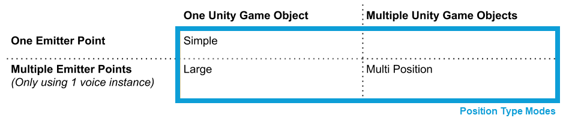
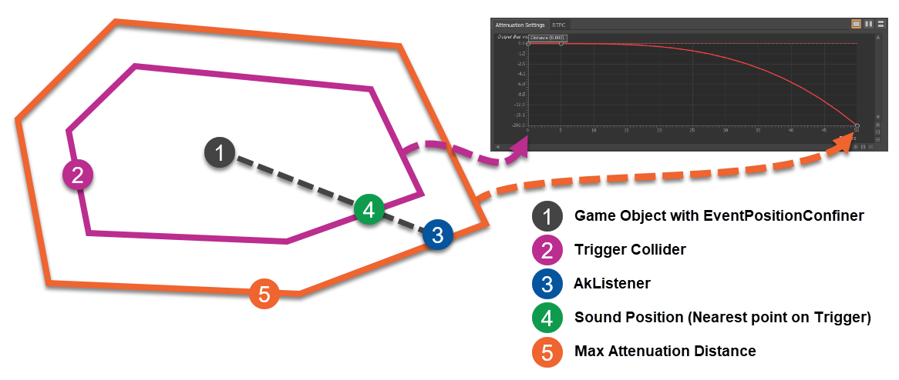



# Ambiences

For ambient sound sources Wwise gives us a special script called AkAmbient. This provides us with extra positioning modes that are more appropriate for ambient sounds that lack directionality of other sounds.

# Posting with AkAmbient

Go to "Posting with Ambience" in Lesson 2.

We will setup the Windmill in the game to play the Windmill Event using the AkAmbient script.

Find the Windmill game object and add an AkAmbient component to it. Center the windmill in the scene so you can see it. Add the Ambient_Windmill Event to the AkAmbient component.

Play to hear the windmill.

# Attenuation Spheres

Attenuation spheres can show us where the player will hear a sound and how far away it is. We'll increase our Max Distance of the Windmill so that we can hear it from further away. We'll know how much by using attenuation spheres. This will give us a visual representation of the Max Distance.

Select the "Attenuation Spheres" lesson.

Select the Windmill game object then change show attenuation spheres to "Current_event_only". We won't see anything right away because this Max Distance data is stored in metadata of sound banks.

Back in Wwise go to Project Settings then select the sound banks tab. Enable "Max Attenuation". Make sure hte "Header file path" is set correctly.

Generate SoundBanks from teh Wwise picker. You should now see an attenuation sphere if you select the Windmill game object. Change your view of the scene so you can see both the windmill and your players position.

Ours is already overlapping, but if it wasn't you would be able to visually see it now.

Back in Wwise search for the Ambient_Windmill blend container. Select the positioning tab then edit the custom attenuation curve. Set the Max Distance to 35.

We can use the temporary radius of the sphere collider to helps us set the max distance. Go back to Unity and set it to 35. Change it until the collider is visually hitting the Player. Then go back into the Attenuation editor and use this value as your Max Distance. Set the sphere collider radius back to 1.

Generate the sound banks and view your new attenuation sphere.

# AkAmbient Position Types

With the AkAmbient script we can disperse our sound from one Event to multiple positions. Large mode will allow for multi position playback. Large mode can not be used on objects that move.

## Using Large Mode

Lets play the game and get familiar with the Library in the Main Scene. We'll use large mode to implement lava sound.

Large mode solves the issue of trying to represent the sound of something that is diffuse and coming from multiple directions especially if it envelopes the player.

Go to the AkAmbient Position Types lesson. Play the game and teleport to the Library. Hear how the lava sound seems to be coming all from one place?

Select the Ambient_Lava game object and changes its position type to "Large_Mode". Click "Add large mode position object". Create more points so that each quadrant of the lava sound is represented.

Enable the attenuation spheres to see where the sound is emanating.

## Using Multi Position Mode

Prefabs are packages of objects that have the same capabilities. We can add a wwise script to a prefab and have each of them behave the same way. We'll add an AkAmbient script to the 301_Torch prefab.

We'll listen to the torch sounds and watch them on the Wwise profiler. Go to Wwise and connect remotely to Unity. Play the game then teleport to the dungeon. The torch sounds are all directly on the objects. View the voice profiler to see that the 301_Torch prefab has been created multiple times, playing the same sound. We can use Multi_Position_Mode to use less CPU power.

We'll alter the prefab to play in multi_position mode. Open a prefab by clicking the arrow right next to its name and change the position type to "Multi_Position_Mode". Exit the prefab. This will automatically save the changes for all prefabs.

Play the game again then view the profiler. Notice how there is only one torch fire event being triggered by Wwise.

# Custom Volumetric Scripts

Having ambiences come from many areas can make mixing a challenge. The EventPositionConfiner will help with this issue.

Select the EventPositionConfiner lesson.

Select the river game object and add a EventPositionConfiner script to it. Set it to the Ambient_River Event.

Focus on the river game object and see it's box collider. Set up Unity so you can see the Scene and Game views at the same time. See the little blue dot move around as you move your character around. This dot represents the "sound position" as it moves around the trigger collider.
