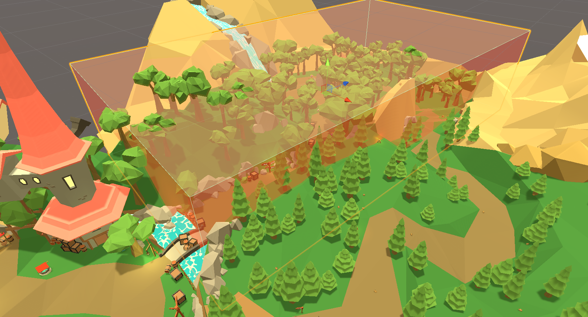



# SoundBank Management

We can load sound banks using a Trigger or from a Scene. These are both ways of managing resources in our game.

# Managing SoundBanks in Unity

With larger projects, it quickly becomes necessary to not load all of our sound banks at the start of the game.

## Loading SoundBanks using Triggers

In the Wwise adventure game sound banks are loaded depending on which region the player is in. If the player is in the Woodlands, the Waterfall event can be played. When the player leaves the Woodlands, the sound bank is unloaded. We can figure this out by having our AkAudioListener trigger when we enter and leave regions.

Open the "Loading SoundBanks using Triggers" lesson. We will be setting up a Box Trigger that spans from the Village bridge to the Cave so we can tell when the player is entering the next region.

Find the Waterfall game object and focus on it. Create a Cube game object and name it Woodlands Trigger. Notice how there is a Box Collider automatically added to the cube. Set it to "is Trigger" so that the player can enter and exit the Collider.

This collider will eventually be invisible, but for development let's make it red. Search for the "Trigger_Red" Material in the Project window and add it to the Woodlands Trigger. Adjust the box so that it looks like the picture below using move, rotate, and scale.

Now add an AkBank script to the Woodlands Trigger. We will be using the "Woodlands" bank. Set the bank to load on AkTriggerEnter and unload on AkTriggerExit. We now have to specify which game objects the trigger responds to so that any random object it encounters won't trigger the bank. So, like in the last lesson add an AkTriggerEnter script and add the Main Camera as the Trigger Object.

Let's test our implementation by opening Wwise and connecting with Remote. Look for the Woodlands sound bank in the profiler load and upload as you collider with the Woodlands Trigger.

## Organizing SoundBanks into Individual Scenes

Our previous method of loading sound banks is a perfectly reasonable way. But there are other ways, such as loading sound banks based on the scene the player is in. The benefit to this method is that when the scene is unmounted all the events associated with that sound bank will be stopped.

Let's make a Scene called "Woodlands" in the Scenes folder. Drag the Woodlands scene to the Hierarchy. We do this so both scenes can be loaded together.

Delete the two objects that came with the scene and add an empty game object called "Wwise". Select the "Woodlands Trigger" and drag the Ak Bank script onto the Wwise game object you just created. Change It's load and unload triggers to Awake and Destroy since we're not using it on a collider any more. Right click on the scene and save it. Right click again and remove it. Notice how it's still in the Assets list.

Select the Woodlands trigger and add the LoadSceneAsyncOnEnter script. Add Woodlands to the "Scene to Load" property. Also add the scene to the "Build Settings" in the File menu. Drag the Woodlands scene into the "Scenes in Build" list. Check that the warning has gone away on the LoadSceneAsyncOnEnter script.

Play the game. The Woodlands scene should load and unload as the player enters and exits the Woodlands Trigger.

## Events posted in Separate Scenes

Since the player can't see the water fall until the Woodlands scene we'll move it there.

Add the Woodlands scene to the Hierarchy. Drag the waterfall game object down to the Woodlands scene.

Let's view our changes in the Wwise profiler. Use the object filter to focus on the "Ambient_Waterfall" event.

Save and remove the scene in Unity.

Play the game and notice that as the main camera enters teh woodlands scene the scene will load and post the Ambient_Waterfall event.

# Decompressing SoundBanks

For games on systems with limited resources (ie mobile games), you may need to use uncompressed files to keep under a size limit. But, decompressing files can be a costly operation. We can do them all at once by working on the sound bank level.

## Decoding Compressed Data

To decode on the sound bank we can select "decode compressed data" on the Ak Bank script.

First connect Wwise remotely and run the game for a minute. Stop the game and go look at the profiler.

Now we can decode the sound bank when loaded and compare the results.

## Saving a Decoded SoundBank

Follow along [here](https://www.audiokinetic.com/courses/wwise301/?source=wwise301&id=Decoding_Compressed_Data#read).

# Loading SoundBanks in Unity
