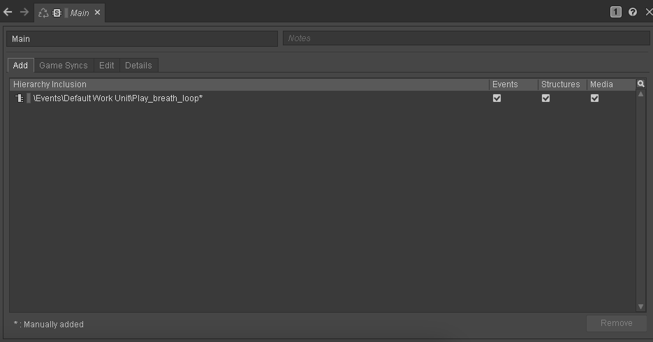

**Based on:** [(116) Game Audio with Unity and Wwise Part 2: Let there be Sound! - YouTube](https://www.youtube.com/watch?v=i2gPkgqVHf4&list=PLzlEBXWjqM97U5rHMERc82sTXRBoSB_Fu&index=2)

# Let there be sound!

## Checking Out the Wwise Adventure Game

From the Wwise launcher, open the WAG in Unity and Wwise. If your Unity project opens to a blank scene, go to the Project tab, then _Assets &#10132; Scenes &#10132; Game Scenes_ and select _Main Scene_. Double-click (or F to focus) the player _GameObject_ to zoom it into view.

> **Zooming and Focusing**
>
> [source](https://gamedev.stackexchange.com/questions/142303/fast-zoom-in-and-out-in-unity-editor)
>
> 1. To enter fast zoom mode, hold Alt + move mouse holding Right Mouse Button.
> 2. Press F to Focus on Game Object.
> 3. Press Shift + F to Focus on Game Object and follow it automatically.
> 4. Hold the right Mouse Button and move with WASD - the more time you spend doing it, the faster speed of movement you will get.

To run the WAG, press the play button in Unity. Play around with it a little bit. To regain control of your mouse, press the escape key. Press the play button again to stop the game. Starting and stopping the game can lag depending on your machine, so be patient.

In the _Hierarchy_ tab, you can see all the _GameObjects_ used in the game. Clicking on a _GameObject_ will show its parameters in the inspector tab. Here, you can change how the _GameObject_ acts within Unity.

We have already seen the Project tab. Here you’ll find all the project’s assets. The console tab will show debug and error messages.

For this game, we must ensure Unity knows where the Wwise executable is. Select edit &#10132; Project Settings &#10132; Wwise Editor. Set the _Wwise application path_ to the version of Wwise that is displayed in the Wwise Launcher.

To learn about how Wwise works with Unity, find the _Evil Spit Plant_ _GameObject_ by searching in the Hierarchy tab. Find the _sound material_ component in the Inspector tab. Open the script by double-clicking on the _SoundMaterial_ script name. This script allows Unity to tell Wwise what material a player is stepping on so that Wwise can trigger the corresponding sound event.

If we look back at the Inspector and click on _Surface_Type/Enemy_EvilPlant_, we can see that we can set this to different switches depending on our needs. For instance, see the Dirt _GameObject_. It has the same script, but now the material is set to the Dirt switch in Wwise.

Go to Wwise, and let’s find the Wwise event that Unity triggers when the player steps on the _Evil Spit Plant_. In the _Events_ tab, locate the _Player_Foostep_ event. Go to the transport control and click the _display switches_ button. Then select the switch Unity set on the _Sound Material_ script. The sound is very quiet for some reason, but you should be able to hear a footstep.

In the Audio tab, find the _Switch Container_ that defines which sound to play for each switch state. Look inside the _Actor-Mixer Hierarchy_. This is where you’ll find all your sound effects.

Wwise’s hierarchies are the _Master-Mixer Hierarchy_, which acts like a DAW mixer providing buses and routing; and the _Interactive Music Hierarchy_, which has unique functionality for synchronizing music.

The basics to take away from this is that in Wwise, we need a sound source &#10132; an event &#10132; and a sound bank.

To get these sounds into Unity, we must first compile the soundbanks in Wwise. To do this, go to Layouts &#10132; SoundBank. We’ll check one more setting to ensure Wwise will export the sound bank correctly. Click the gear on the right of the screen &#10132; User Soundbank Settings.

Select your current deployment platform. I’ll select Mac. Also, choose English. Then, choose _Generate Checked_. We see errors related to the license, which we won’t take the time to fix. But this is the process we’ll go through to generate sound banks in future lessons.

<!-- ## The Sounds We Will Use

We’ll use the sounds from the [Sonniss GDC 2020 Audio Bundle](https://sonniss.com/gameaudiogdc). From Sonniss:

> Each year we give away thousands of dollars worth of sounds for free in celebration of the Game Developers Conference. This is our archive. All the sound effects are royalty free and commercially usable with no attribution required. You can use the sound effects on an unlimited number of projects.

This library is quite large, so I’ll try to narrow down what samples you’ll use. -->

## Setting up the playground in Unity

Go ahead and open up the new Wwise and Unity projects we created last class. We’ll begin to add sounds to it now. To get starting added elements to our Unity project, we’ll add some premade assets using the [Unity Asset Store](https://assetstore.unity.com/). What we want to add to our project is the [Starter Assets - First Person Character Controller](https://assetstore.unity.com/packages/essentials/starter-assets-first-person-character-controller-196525). Click the _Add to Assets_ button &#10132; _Open in Unity_. Once in Unity, select the asset in the package manager, then download and import. Make sure you have _My Assets_ set, or you won’t see the asset you just added from the store.

Select all the assets and click import to bring them into your project.

Accept the update to the new input manager and wait for Unity to restart.

You should now have a folder in your Assets folder called _StarterAssets_. Find the _Playground_ scene and open it. Play with the scene for a minute. Click the mouse in the scene to hide the pointer and make it easier to navigate. Press the escape key to return to the Unity Editor.

## Our first sound!

Finally, we’ll add some sounds to Wwise and have Unity trigger Wwise events so we can hear sound. We’ll use a pulsating breath sound. I'll use one from [freesound.org](https://freesound.org/people/gerainsan/sounds/457046/).

The easiest way to add a sound is to drag and drop it onto the _Default Work Unity_ of the _Actor-Mixer Hierarchy_. Some options pop up. Leave these all how they are for now and click import. Test your sound by clicking the space bar or the play button in the _Transport Control_. If you don’t see the _Transport Control_, ensure you’re in the designer layout (Layouts &#10132; Designer). Set the sound to looping.

Let’s create an event that will trigger this sound. Right-click on the sound, then New Event &#10132; Play. This opens up the Event in a new tab. You can see that it’s an even type of _Play_ connected to the sound we just added. You may be wondering why we can’t just trigger sound directly. Using events will allow us to trigger many sounds by just one event.

We’ll now add this event to a sound bank so Unity can see the event. Switch to the SoundBank layout (Layouts &#10132; SoundBank). In the SoundBanks tab, select the _Default Work Unit_ and click the _Create new 'SoundBank'_ button. Call this new SoundBank _Main_. Select the new SoundBank in the User-Defined SoundBanks list, then add your event to the list below.

Now you can generate the SoundBank with this new event. If everything was successful, you should see your event in the Events section of the Wwise Picker in Unity.

> Note: Be careful if you use iCloud; it broke my SoundBank export.

We now need to load the Main soundbank in Unity. The easiest way to do this is to find the _Main_ soundbank in the Wwise Picker, then drag it onto the Inspector of the _WwiseGlobal_ _GameObject_. Set the SoundBank to load on _Awake_.

To trigger the event, we need to add it to a _GameObject_. Choose one of the bricks and drag the event onto its Inspector. Add a _RigidBody_ if it asks.

This will automatically add an _AkAmbient_ _GameObject_. Leave it to trigger on start, so it starts when you load the game.

Run your game. You should now hear the breathing sound. If you don't hear it try regenerating your _SoundBank_ and saving your Wwise project.

Finally, let’s add some positioning to the sound so that we only hear it if the player is close to the block. In the Designer layout, find the sound source again. Set the _3D Spatialization_ in the positioning tab to _Position_.

Generate the SoundBank and save Wwise. Now you should hear a spatialized sound depending on the player’s orientation.
