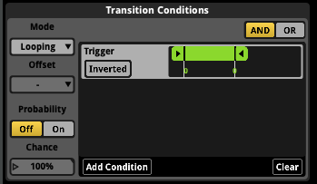

## Introduction

In this tutorial, you’ll build a reactive teleportation sound system by controlling FMOD parameters from Unity using C#. You’ll learn to:

* Create and automate parameters in FMOD
* Instantiate and attach FMOD events in Unity
* Dynamically set parameter values via C# scripts
* Trigger sound transitions via Unity collision events

FMOD Parameters are made up of a range of values that can be adjusted in real-time inside our
game. This allows us to create dynamic audio that responds to gameplay events, such as a player entering a teleporter.

---

## FMOD Setup

Before diving into code, we’ll first build the **teleporter event** in FMOD.
This event demonstrates how to use both **built-in** and **user parameters** to control sound behavior dynamically.

### Goal

We’re designing an event that:

* Loops a magical hum sound for a teleporter object.
* Uses the built-in **Distance** parameter to fade out low frequencies as the listener moves away.
* Uses a custom **Trigger** parameter to fire a secondary teleport sound when the player enters the teleporter.

When done, your FMOD setup will let Unity control when the teleport sound plays—while FMOD automatically handles distance-based EQ changes.

---

### 1. Create the Event

1. Open **FMOD Studio**.
2. In the **Assets Browser**, find *Teleporter Loop Stereo 01* under
   `Audio Bin → Interactables → Teleporters`.
3. Create a new event named **Teleporter** in the `SFX/Interactables` folder.
4. Drag *Teleporter Loop Stereo 01* onto **Track 1** at the beginning of the timeline.

---

### 2. Loop Region and Asynchronous Playback

1. Create a **loop region** around the first second of the timeline.
   This keeps the playhead cycling near the start while the loop plays.
2. Select your sound instrument and:
   * Enable **Async** playback. This ensures the sound plays to completion even if the playhead remains in the loop region.
   * Enable **Loop While Playing**.
   * Enable **Cut** (cut playback when untriggered) — so when the loop region deactivates, playback stops immediately.

This ensures your hum continues smoothly in a loop until another parameter (like Trigger) ends it.

---

### 3. Add and Automate the Distance Parameter

The **Distance** parameter is one of FMOD’s built-in parameters.
There are six built-in parameters: Distance, Direction, Speed, Orientation, Elevation, and Cone Angle.

Built-in parameters automatically update based on the listener’s position relative to the sound source in 3D space.

See more information here: [FMOD Built-In Parameters](https://www.fmod.com/docs/2.03/studio/parameters-reference.html#built-in-parameters)

**To add and automate Distance:**

1. Click the “+” icon → choose **Add Parameter Sheet → New Parameter**.
2. Name it **Distance** and choose the **Built-In** type for **Distance**.
3. On your track, insert a **3-Band EQ** effect (right-click near the track fader → Add Effect → EQ → 3 Band EQ).
4. Right-click the **Low Gain** knob on the EQ and choose *Add Automation*. Then click **Add Curve** and select **Distance**.
   1. You have now connected your Distance parameter to the low-frequency gain control on the EQ.
5. You’ll see a red automation curve appear under the track.
6. Draw the curve so that as Distance increases, the low end fades out.

This simulates real-world behavior—low frequencies carry farther, so as the player gets closer, you regain that low-end presence.

---

### 4. Create the Custom Trigger Parameter

Now we’ll add the parameter Unity will control.

1. In the Parameters tab, click “+” → *Add New Parameter*.
2. Choose **Discrete** type (whole-number values).
3. Name it **Trigger**.
   * Discrete values are ideal for toggling between on/off or state-based conditions.
4. Set its range:
   * **Min:** 0
   * **Max:** 1
5. In your event:
   * Place the second sound (*Teleporter Walk Through 01*) under the same track or on a new one.
   * Go to the Loop region and open its **Trigger Conditions** panel.
   * Set it to **play when Trigger = 1**.
6. For the looping hum track:
   * Open its **Condition Sheet** and add a condition to **disable playback when Trigger = 1**.
   * Add a short fade-out automation for smooth transition.

When Trigger switches from 0 to 1, the looping hum fades, and the teleport sound plays once.



---

### 5. Fine-Tune Spatialization

1. On the **Master Track**, open the **Spatializer** effect.
2. Adjust **Min Distance** and **Max Distance** values so the attenuation curve fits your in-game scale (e.g., smaller values for tight interior scenes, larger for outdoor).
3. Preview using the 3D Preview window in FMOD to confirm how the sound falls off with distance.

---

### 6. Save and Build

Finally:
* Save the project.
* Assign your event to the **Master Bank**.
* Build your banks (`File → Build → Build Banks`).

You’re now ready to load this event in Unity.

---

### 7. Test in FMOD Before Unity

Play your event in FMOD:

* Drag the **Distance** slider to watch the EQ automation respond.
* Set **Trigger = 1** to hear the teleport sound override the loop.

You should observe:

* The low-end fading out naturally as Distance increases.
* The teleport sound firing instantly when Trigger hits 1.
* The loop stopping cleanly when the parameter condition disables it.

This confirms everything is wired properly before moving to C# integration.

---

## Unity Scene Setup

* Find the teleporter in the scene. Its the `TransitionStart` game object. 
* Make sure the teleporter has a **Box Collider** (or whatever shape), set to *Is Trigger*.
* Place your player (e.g. “Ellen”) in the scene. This will make our sounds easier to test.
  * Find Ellen and change her transform position to `X: -145, Y: 21.3, Z: 43`.
  * Alternatively, copy the position of the `TransitionStart` object then paste it into Ellen’s transform, then adjust the X position by -5 to start just outside the trigger.
* Disable or remove other objects so they won't interfere during testing by unchecking their active state in the **Inspector**.

---

## C# Script: `F_Teleporter.cs`

Create a script under your `Scripts/FMDO Scripts` folder named `F_Teleporter.cs` and attach it to your teleporter object (the same object holding the trigger collider).
Here’s the full script:

```csharp
using UnityEngine;

public class F_Teleporter : MonoBehaviour
{
    
    FMOD.Studio.EventInstance tHum;
    void Start()
    {
        tHum = FMODUnity.RuntimeManager.CreateInstance("event:/SFX/Interactable/Teleporter");
        FMODUnity.RuntimeManager.AttachInstanceToGameObject(tHum, gameObject, GetComponent<Rigidbody>());
        tHum.start();
    }

    // Update is called once per frame
    void OnTriggerEnter(Collider other)
    {
        // Could also use other.CompareTag("Player") for more robust checking if the Player game object had the tag "player"
        if (other.name == "Ellen")
        {
            tHum.setParameterByName("Trigger", 1, false);
        }
    }
    
    void OnDestroy()
    {
        tHum.stop(FMOD.Studio.STOP_MODE.IMMEDIATE); 
        tHum.release(); 
    }
}
```

### Key Points

* `CreateInstance(path)` must match exactly the FMOD event path.
* `AttachInstanceToGameObject(...)` aligns spatial 3D behavior (so position/distance is tracked).
* `setParameterByName("Trigger", 1f, false)` changes your `Trigger` parameter.
  * The `false` flag means you don’t bypass seek speed — FMOD seeks based on your parameter settings.
* `release()` frees memory and ensures no audio leaks after object destruction.

---

## Testing & Debugging

1. Hit **Play** in Unity.
2. Move the listener close to the teleporter — you should hear the ambient loop with full low frequencies.
3. As you back away, low frequencies fade (due to the Distance → EQ automation).
4. Walk into the trigger: the teleport sound plays, and the loop stops or fades.

If things don’t work:

* Confirm the collider is set to *Is Trigger*.
* Double-check your player object’s **name** (or change the script to use a tag).
* Ensure the FMOD event path is correct and that the event’s bank is loaded.
* In FMOD Studio, verify your parameter mapping and that `Trigger = 1` is correctly wired.


