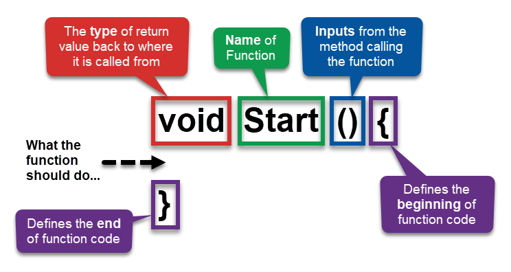
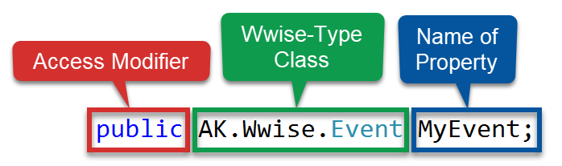
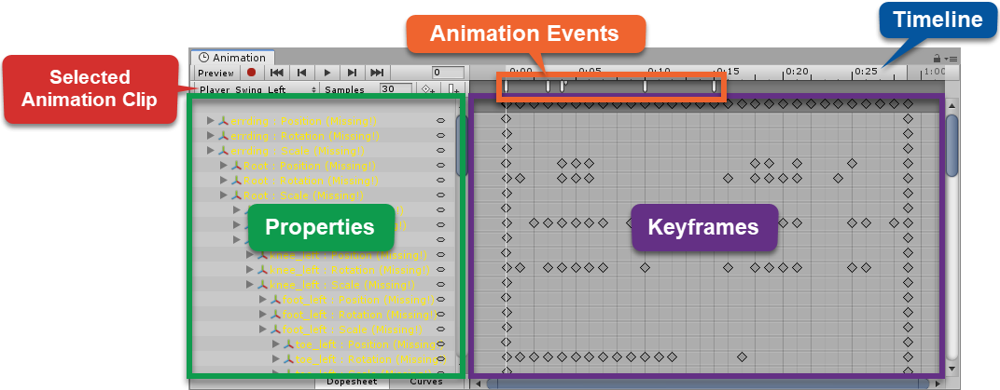

# Posting Events from a Script

This involves using Unity scripting to run your events, giving you more control over how things are triggered.

# Posting Events using Wwise-Types

## Creating a Wwise-Type Event property

Open the "Posting Events using Wwise-Types" lesson in the Wwise project. We'll make a script that has a Wwise-Type Event class variable.

Create a new script on the Player game object called "PostWwiseEvent". Double-click the script to open it in Visual Studio.

Unity has created the following script to get you started:

```c#
using System.Collections;
using System.Collections.Generic;
using UnityEngine;

public class PostWwiseEvent : MonoBehaviour {

    // Use this for initialization.
    void Start () {

    }

    // Update is called once per frame.
    void Update () {

    }
}
```

We can break down the script into parts:

- Namespaces
  - Import code from C# and Unity to make writing scripts easier
- The Class
  - Allows use of Unity specific code. Everything you write will be included between the curly braces of the Class. Notice that the class name matches the name of the script.
- Functions



We'll be adding this line to our script:



Add this inside the class but above the start function. Save the script and return to Unity.

## Assigning and Posting a Wwise-Type Event

We'll now actually post the event in the script. Add this to the Start function:

```c#
MyEvent.Post(gameObject);
```

This will select the current game object and post the event on it.

Back in Unity select the Destruction_Rock_Destroy Event event.

Play the game to hear the rock event. We don't really need this event, but it's good to test that we can post events from scripts.

# Posting Events from Animations

We have to post events from animations when we need the sounds to match closely with the animations such as when the player jumps or walks.

Select the "Posting Events from Animations" lesson in the Wwise project.

Add the PostWwiseEvent script to the Player game object. Add the "Player_Footstep" event.

Open the script. We want to move the event posting to a function so it doesn't run at the start of the script. Replace the Start() function with the following:

```c#
public void PlayFootstepSound() {
    MyEvent.Post(gameObject);
}
```

Save the script and return to Unity.

Select the Player game object and open the Animation window from Window > Animation. Drag the window to dock it to the bottom of the screen. This window has the following parts:



Open the menu list to see all of the animations in the game. Select "Player_Sprint".

Move your cursor along the timeline and view the player moving.

Make it easier to see what's happening by removing "3D Icons" in the Gizmos tab. Locate the exact position in the animation where the footstep sound should be played. Start with the right foot. Right click at this point and add an animation event. Assign this event to the "PlayFootstepSound" function. Do the same thing with the left foot.

Save all the changes to the prefab.

Play the game and sprint to hear the footsteps.

# Posting Audio Input

Let's skip this section.
