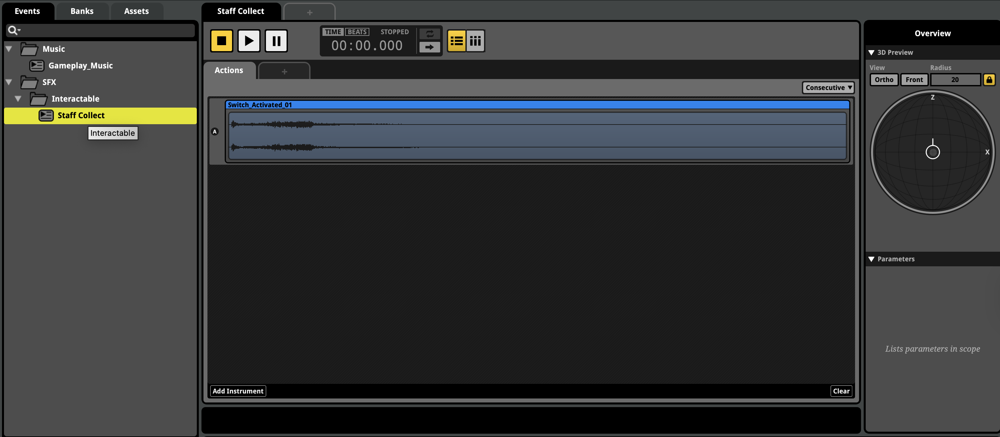
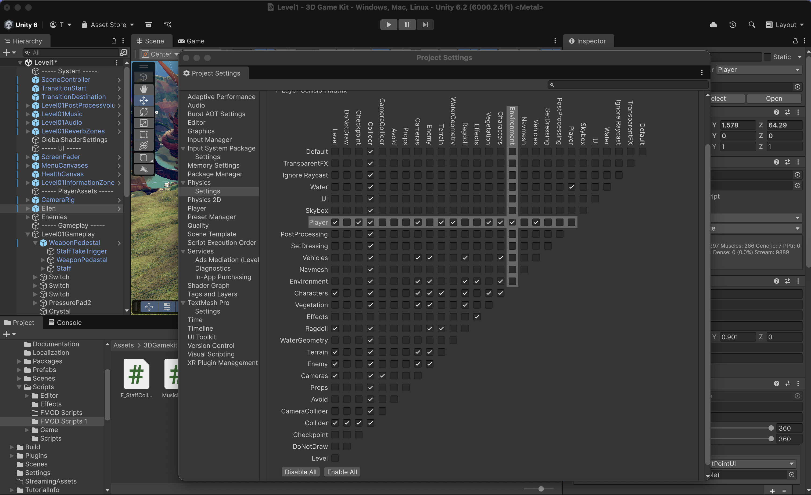

## Introduction

In game audio, efficiency matters. When designing sound interactions in Unity using FMOD, there are many cases where you only need a sound to play once—like when a player picks up an item or activates a switch. Writing full event-handling code for each instance can quickly become cumbersome.

That’s where FMOD’s **PlayOneShot** command comes in. This function provides a fast, elegant way to trigger short, non-looping sound effects in your game world without manually managing event instances. In this guide, we’ll walk through how to use **PlayOneShot** and **PlayOneShotAttached**, explain how Unity’s trigger system ties in, and unpack key technical concepts like Vectors, Colliders, and Layers.

---

## What Is PlayOneShot?

FMOD’s `PlayOneShot` command allows you to play an FMOD event anywhere in your game with a single line of code. When the command is called, it automatically plays the event and then cleans up after itself when the sound finishes—no need to store or release the event manually. 

This makes it ideal for simple, one-off sound effects such as button clicks, weapon pickups, or door openings.

For instance, if we want to trigger a short sound effect when a player picks up their melee weapon, `PlayOneShot` lets us do it with minimal setup.

---

## Setting Up the Event in FMOD

1. **Create a new 3D Action event** called `Staff Collect` and add your audio file (for example, `Switch Activated 01`).
2. Assign the event to your **Master Bank**.
3. Organize it neatly under **SFX → Interactables**.
4. Save your project and **build your banks**.

Once you’ve done that, switch back to Unity to implement the sound event.

> Action Events are perfect for short, non-looping sounds that play once and then stop. They are typically used for sound effects triggered by player actions or environmental events.



---

## Using Triggers in Unity

A **Trigger** in Unity is an invisible area that detects when objects (like your player) enter or leave it. Triggers are built using colliders with the **Is Trigger** box checked. When something passes through, Unity can perform specific actions—such as playing a sound.

For our weapon pickup example:

- The `StaffTakeTrigger` object in your scene will act as the trigger.
- It already has a **Sphere Collider** attached with **Is Trigger** enabled.
- When the player enters this area, Unity can detect the interaction and execute our FMOD command.

We’ll connect this trigger to our FMOD event using a custom script.

---

## Writing the Trigger Script

Go to your `FMOD Scripts` folder and create a new C# script called `F_StaffCollectTrigger` attach it to the `StaffTakeTrigger` object.

Delete the default `Start` and `Update` functions, as we won’t need them for this simple interaction.

Inside the script, we’ll use the `OnTriggerEnter` function. This Unity event function runs automatically when another object enters the trigger’s collider.

```csharp
using UnityEngine;

public class F_StaffCollectTrigger : MonoBehaviour
{
    void OnTriggerEnter()
    {
        FMODUnity.RuntimeManager.PlayOneShot("event:/SFX/Interactables/StaffCollect", transform.position);
    }
}
```

> ```onTriggerExit``` is another useful function that runs when an object leaves the trigger area. You can use it for sounds that should play when the player exits, like a door closing. ```onTriggerStay``` runs continuously while an object remains within the trigger.

This is all it takes to trigger the *Staff Collect* sound effect when the player enters the area.

However, we can improve this setup by specifying *where* in 3D space the sound should be played.

---

## Understanding Vectors in Unity

To position sounds accurately, we need to work with **Vectors**—data types that store coordinates and direction.

* **Vector2** holds *x* and *y* coordinates (useful for 2D games).
* **Vector3** holds *x*, *y*, and *z* coordinates (used in 3D games).

In Unity, almost every object’s position, rotation, and scale are stored as Vector3 values. To access the current position of your object, you can reference its **Transform** component.

> Here, `transform.position` retrieves the Vector3 position of the object this script is attached to (the trigger). This is shorthand for `GetComponent<Transform>().position`.

If you want to play the sound at a different location but related to the trigger, you can create a new Vector3:

```csharp
Vector3 pos = transform.position + Vector3.up * 1.5f;
FMODUnity.RuntimeManager.PlayOneShot("event:/SFX/Interactables/StaffCollect", pos);
``` 

This example plays the sound 1.5 units above the trigger’s position.

---

## Layers and Collision Setup

For the trigger to work correctly, Unity needs to detect when the player enters the trigger area. This requires proper setup of **Layers** and **Colliders**.

1. The object acting as the trigger must have a collider with **Is Trigger** checked.
2. The player object must either:
   * Have a **Rigidbody** component, or
   * Be on a layer compatible with the trigger’s layer.

You can manage these interactions in Unity’s **Layer Collision Matrix** under *Edit → Project Settings → Physics*.
Ensure that the **Player** layer can interact with the **Environment** layer (or whichever layer your trigger belongs to).

> Tags and Layers help organize objects in your scene and control how they interact. Tags are used for identifying objects, while Layers are used for collision detection and rendering.



Here you can see the Layer Collision Matrix in Unity, which defines how different layers interact with each other. See that the **Player** layer can collide with the **Environment** layer, allowing our trigger to detect when the player enters.

---

## Using PlayOneShotAttached

While `PlayOneShot` requires a position vector, FMOD also offers a variant called `PlayOneShotAttached`. This version automatically plays an event at the location of a specific game object.

Here’s how to use it:

```csharp
void OnTriggerEnter()
{
    FMODUnity.RuntimeManager.PlayOneShotAttached("event:/SFX/Interactables/StaffCollect", gameObject);
}
```

The `gameObject` reference points to the object this script is attached to—in this case, `StaffTakeTrigger`.
This makes it an elegant alternative when you want to link the sound directly to an object’s position.

If you want to attach the sound to another object in the scene, you can define a **public GameObject variable** in your script and assign it through the Unity Inspector:

```csharp
public GameObject Obj;

void OnTriggerEnter()
{
    FMODUnity.RuntimeManager.PlayOneShotAttached("event:/SFX/Interactables/StaffCollect", Obj);
}
```

This approach provides flexibility for triggering sounds from different points in your game world.

---

## Limitations and Next Steps

While `PlayOneShot` and `PlayOneShotAttached` are great for quick, lightweight sound triggers, they come with a limitation:
you can’t manipulate FMOD parameters after triggering them.

For cases where you need to control parameters dynamically (for instance, changing pitch or volume in response to player movement), you’ll need to use full event instances instead.

We’ll explore this in the next module: **Interacting with FMOD Parameters**—where you’ll learn how to adjust event behavior in real time for adaptive sound design.

---

## Conclusion

The `PlayOneShot` and `PlayOneShotAttached` commands streamline the process of triggering short, non-looping sounds in Unity. Combined with Unity’s trigger system and a solid understanding of Vectors and Layers, they allow you to quickly prototype interactive sound behaviors.


