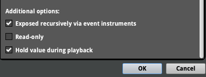

## Introduction

This post walks through a practical pipeline for triggering FMOD sound events from Unity Animation Events so your character’s footsteps, landings, and swishes line up precisely with what’s on screen. We’ll build a reusable C# function that can be called from any Animation Event and, later, accept the FMOD event path as a parameter—setting us up to drive parameters (like surface material) in a follow-up lesson.

---

## What You’ll Build 

* An FMOD event for a footstep, with a `Material` parameter that selects between multiple surface types.
* A Unity C# function that:
  * Creates and attaches an FMOD event instance to the player at runtime,
  * Starts the event,
  * Releases the instance,
  * Accepts a string parameter for the FMOD event path (so you can reuse it across many animations).
* Animation Events in Unity that call your C# function exactly when each foot hits the ground.

---

## FMOD Setup: A Single Footstep Event, Many Materials

Create a 3D event named `Ellen_Run` in the `SFX/Ellen` folder that plays one footstep per trigger.

Add a user parameter named `Material` and set it to Hold (so the footstep that already triggered won’t switch mid-play if the parameter changes). Add four values representing different surface types:

1. Earth
2. Stone
3. Puddle
4. Grass


Set the parameter to Hold during playback to allow the current footstep to complete even if the player moves to a different surface.



Add a Multi Instrument (right-click, then `Add Multi Instrument`) for each material value and add the appropriate footstep samples for that surface. Enable Shuffle in the Multi Instrument settings to randomize footstep playback.


Now, when you select different values for the `Material` parameter, you’ll hear footsteps on different surfaces.

Save your project and build your banks before switching back to Unity.

---

## Unity Project Setup

Create a script named `F_Player` and add it to your player (Ellen) GameObject. This script will own all player-related SFX behaviors.

### The Reusable One-Shot Function

We’ll implement a “play one-shot with control” pattern: create an instance, attach it to the player, start it, and release it—while still allowing parameter control if we need it later.

Here’s a simple implementation using a new `PlayRunEvent` function. We use a public function so that Unity Animation Events can call it directly. For now we hardcode the event path; in the next section we’ll update the function to accept a string parameter so different animations can play different events.
```csharp
    public void PlayRunEvent()
    {
        EventInstance run = RuntimeManager.CreateInstance("event:/SFX/Ellen/Ellen_Run");
        RuntimeManager.AttachInstanceToGameObject(run, gameObject, GetComponent<Rigidbody>());
        run.start();
        run.release();
    }
```


Why this approach instead of `RuntimeManager.PlayOneShot(...)`?

* It gives you full control over parameters (e.g., `Material`) per trigger.
* It’s easy to reuse: different animations can pass different event paths into the same function.


---

## Hooking Up Unity Animation Events

Animation Events in Unity let an animation call your function at a specific frame. For footsteps, add an event exactly when each foot contacts the ground.

1. Locate Ellen’s run animations in the Project window:
   * `3DGameKit/Art/Animations/AnimationClips/Characters/Ellen/`
   * Expand the `Ellen Run Forward` FBX to see its clips (forward, diagonal, etc.).
2. Preview the clip in the Inspector. If you see “No model is available for preview,” drag the Ellen model into the preview window from `Art/Models/Characters/Ellen`.
3. Find the `Ellen_Run_Forward` clip and click it to open the Animation tab. Click Edit to unlock it for modification.
   1. 
4. Open the Events tab on the animation.
   1. 
5. Scrub the timeline to the exact frame the foot contacts the ground.
6. Click Add Event. In the Function field, enter `PlayRunEvent`.
7. Add a second event for the other foot.
8. Click Apply to save the clip modifications.
9. Play the scene and run forward; you should hear a footstep on each contact.

Important: The script containing the target function must live on the same GameObject that plays the animation via an Animator. Otherwise, the Animation Event won’t be able to find your function.

---

## Add the Event Path Parameter

Now that the events are triggering, let’s pass the FMOD event path as a string parameter so we can reuse this function for other animations (like landing or attacking) later.

Edit your `F_Player` script to update `PlayRunEvent` to accept a string parameter for the event path, as shown below.

```csharp
    public void PlayRunEvent(string eventPath)
    {
        EventInstance run = RuntimeManager.CreateInstance(eventPath);
        RuntimeManager.AttachInstanceToGameObject(run, gameObject, GetComponent<Rigidbody>());
        run.start();
        run.release();
    }
```

In your Animation Events, update each event to pass the event path string:
`event:/SFX/Ellen/Ellen_Run` (or whatever your event path is).

---

## Understanding C# Parameters

We defined `PlayRunEvent(string eventPath)` so each animation can pass its own FMOD event path. This is a value parameter: the Animation Event provides a string, Unity passes it into your function at call time, and you use that to create the event instance.

This pattern scales nicely:

* Walk clip → `event:/SFX/Ellen/Ellen_Walk`
* Land clip → `event:/SFX/Ellen/Ellen_Land`
* Attack clip → `event:/SFX/Ellen/Ellen_Slash`

You keep one function and let animations decide which event to play.

---

## Common Pitfalls

* The function name in Animation Events must match exactly, including case.
* The script with `PlayRunEvent` must be on the animated GameObject (the same one with the Animator).
* Don’t forget to click Apply after editing Animation Events; missed applies are a classic time sink.
* Always call `release()` after `start()`; this defers cleanup until playback ends.
* If your footstep feels off by a few frames, adjust the event position slightly in the animation timeline—what looks like “contact” in the mesh may need a tiny lead or lag to feel right in-game.

---

## Helpful Links

* [Unity Animation Events Documentation](https://docs.unity3d.com/Manual/AnimationEvents.html)
* [FMOD Unity Integration Documentation](https://fmod.com/resources/documentation-unity?version=2.0&page=welcome.html)
* [FMOD EventInstance API Reference](https://fmod.com/resources/documentation-api?version=2.0&page=core-api-studio-eventinstance.html)    
* [Unity Scripting API: Rigidbody](https://docs.unity3d.com/ScriptReference/Rigidbody.html)


---

### More complete version with error checking and parameterization:

```csharp
using UnityEngine;
using FMODUnity; // FMOD Unity integration
using FMOD.Studio; // FMOD Studio API

// by including these namespaces, we can use FMOD types directly

public class F_Player : MonoBehaviour
{
    // Optional: cache components you’ll likely need
    private Rigidbody _rb;

    void Awake()
    {
        _rb = GetComponent<Rigidbody>();
    }

    // Called by Unity Animation Events. Pass an FMOD event path, e.g. "event:/SFX/Ellen/Ellen_Run"
    public void PlayRunEvent(string eventPath)
    {
        if (string.IsNullOrEmpty(eventPath))
        {
            Debug.LogWarning("PlayRunEvent called without a valid FMOD event path.");
            return;
        }

        EventInstance run = RuntimeManager.CreateInstance(eventPath);

        // Attach to this GameObject so the sound follows the player and 3D attenuation works as expected
        RuntimeManager.AttachInstanceToGameObject(run, gameObject, _rb);

        run.start();
        run.release(); // Safe: schedules the instance for cleanup after playback finishes
    }
}
```
