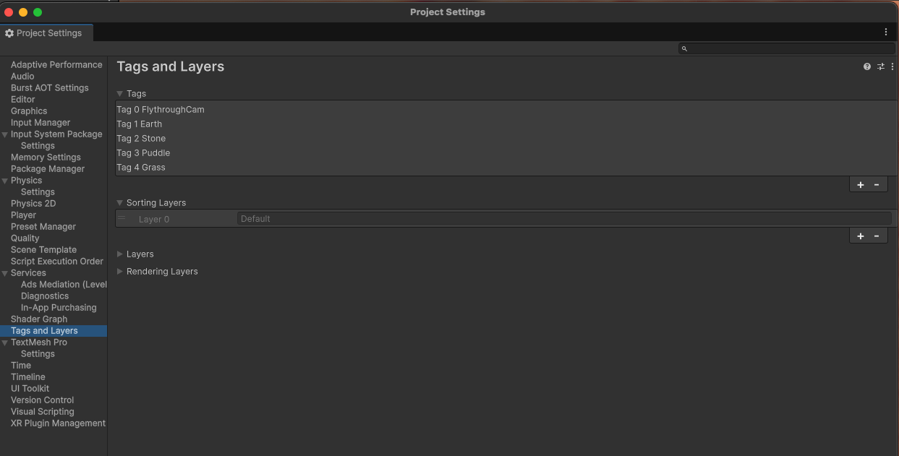
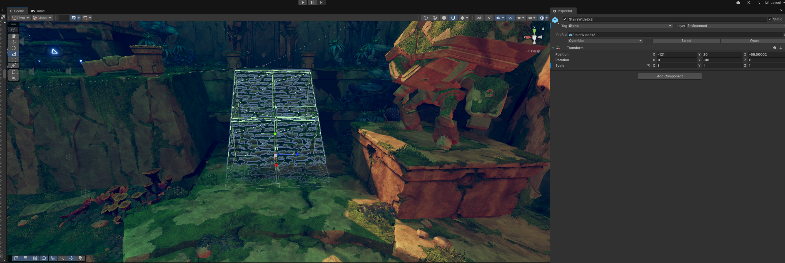

## Introduction

Creating immersive game soundscapes often comes down to subtle details—like the sound of footsteps adapting to different surfaces. In this tutorial, we’ll expand upon previous FMOD parameter work by integrating Unity’s physics system to detect materials underfoot. Using **raycasting** and **tags**, we’ll dynamically alter footstep sounds to reflect the player’s environment—be it grass, stone, puddles, or earth.

This guide walks through each step: tagging surfaces, scripting raycasts, and linking an enum-backed FMOD parameter for a responsive, data‑driven footstep system. If you follow along from top to bottom, you’ll go from a blank scene to fully adaptive footsteps.

---

## Recap: Where We Left Off

In the previous session, we created a simple FMOD event that played footstep sounds through Unity animation triggers. We:

1. **Created a footstep event** in FMOD with a “Material” parameter.
2. **Wrote a Unity C# script** to instantiate, play, and destroy the event on each step.
3. **Linked animation events** to ensure footstep sounds triggered precisely in sync.

Now, we’ll enhance that system so footsteps automatically change depending on what surface the player is walking or running across.

---

## Step 1: Setting Up Tags in Unity

Tags let you label objects and detect them in scripts. Each surface type gets a unique tag.

1. Navigate to **Edit → Project Settings → Tags & Layers**.  
2. Under **Tags**, click **+** and add:
   - Earth  
   - Stone  
   - Puddle  
   - Grass  



Assign these tags to relevant scene objects—terrain, stairs, platforms, etc. Apply the tag to the collider you expect the raycast to hit (often on the same GameObject that has the Mesh Collider or Box Collider).


Tagging even a few surfaces is enough to test. Later, we'll expand this system to cover more materials using Physics Materials or Terrain Textures.

---

## Step 2: Script Framework

Start by defining an enum for surface types and the core fields/methods in your player script. Add this to your player controller (or a dedicated audio component on the player).

> An enum is a new data type we haven't used yet. It lets us define a set of named constants, which we can use to represent discrete values (like surface types). This makes our code more readable and less error-prone than using raw integers or strings.

```csharp
using UnityEngine;
using FMODUnity;
using FMOD.Studio;

public enum MaterialType { Earth = 0, Stone = 1, Puddle = 2, Grass = 3 }

public class F_Player : MonoBehaviour
{
    [SerializeField] private LayerMask groundLayerMask;
    [SerializeField] private float rayDistance = 1.5f;

    private MaterialType currentMaterial;
    private RaycastHit hitInfo;
    private Rigidbody rb;

    private void Awake()
    {
        rb = GetComponent<Rigidbody>();
    }

    private void Update()
    {
        // Step 4 will explain this debug line
        Debug.DrawRay(transform.position, Vector3.down * rayDistance, Color.red);
    }

    public void PlayRunEvent(string eventPath)
    {
        if (string.IsNullOrEmpty(eventPath)) return;
        MaterialCheck();
        EventInstance run = RuntimeManager.CreateInstance(eventPath);
        RuntimeManager.AttachInstanceToGameObject(run, gameObject, rb);
        // Step 6: we'll create/start the FMOD event and set the parameter
    }

    private void MaterialCheck()
    {
        // Steps 3–5: raycast and set currentMaterial
    }
}
```

Notes:
- Enum names must match tags exactly: `Earth`, `Stone`, `Puddle`, `Grass`.
- `groundLayerMask` should include only layers containing walkable geometry.
- `rayDistance` defaults to 1.5m; adjust to your character height.
  
---

## Step 3: Raycasting to Detect Surfaces

The script casts a ray downward from the player to find the surface beneath:

```csharp
if (Physics.Raycast(transform.position, Vector3.down, out hitInfo, rayDistance, groundLayerMask))
{
    // hitInfo.collider is the surface collider we tagged
}
```

- `transform.position` = Player position
- `Vector3.down` = Direction toward the ground
- `rayDistance` = Ray length (default 1.5m)
- `groundLayerMask` = Limit detection to your environment layers (e.g., `Environment`, `WaterGeometry`)

In the Inspector, assign the `groundLayerMask` to include only layers with tagged ground geometry.

If you find gaps on stairs or steep terrain, consider a small sphere cast:

```csharp
if (Physics.SphereCast(transform.position, 0.1f, Vector3.down, out hitInfo, rayDistance, groundLayerMask))
{
    // Slightly more forgiving than a thin ray
}
```

---

## Step 4: Visualize the Ray

The script draws the ray each frame for easy debugging:

```csharp
Debug.DrawRay(transform.position, Vector3.down * rayDistance, Color.red);
```

View this in the Scene window as you move the player to ensure correct origin and length.

---

## Step 5: Tags → Enum Mapping

Inside `MaterialCheck()` and `Raycast` if statement, add this code to convert the detected tag into the enum value:

```csharp
if (System.Enum.TryParse(hitInfo.collider.tag, out MaterialType material))
{
    currentMaterial = material;
}
```

- TryParse: Attempts to map the tag (e.g., "Stone") to `MaterialType.Stone`.
- Safe update: Only assigns `currentMaterial` when parsing returns true; otherwise the previous value remains.
- Optional default: If you want an explicit fallback when parsing fails, add an else:

```csharp
if (System.Enum.TryParse(hitInfo.collider.tag, out MaterialType material))
{
    currentMaterial = material;
}
else
{
    currentMaterial = MaterialType.Earth; // default
}
```

---

## Step 6: FMOD Parameter Setup

The script sets the parameter via, which you'll add inside `PlayRunEvent` before starting the event:

```csharp
run.setParameterByName("Material", (float)currentMaterial);
```

---

## Step 7: Full Script

Here’s the complete script with all steps combined:

```csharp
using UnityEngine;
using FMODUnity;
using FMOD.Studio;

public enum MaterialType
{
    Earth = 0,
    Stone = 1,
    Puddle = 2,
    Grass = 3
}

public class F_Player : MonoBehaviour
{
    [SerializeField] private LayerMask groundLayerMask;
    [SerializeField] private float rayDistance = 1.5f;
    
    private MaterialType currentMaterial;
    private RaycastHit hitInfo;
    private Rigidbody rb;
    
    private void Awake()
    {
        rb = GetComponent<Rigidbody>();
    }

    private void Update()
    {
        Debug.DrawRay(transform.position, Vector3.down * rayDistance, Color.red);
    }

    public void PlayRunEvent(string eventPath)
    {
        if (string.IsNullOrEmpty(eventPath)) return;
        
        MaterialCheck();
        
        EventInstance run = RuntimeManager.CreateInstance(eventPath);
        RuntimeManager.AttachInstanceToGameObject(run, gameObject, rb);
        run.setParameterByName("Material", (float)currentMaterial);
        run.start();
        run.release();
    }
    
    private void MaterialCheck()
    {
        if (Physics.Raycast(transform.position, Vector3.down, out hitInfo, rayDistance, groundLayerMask))
        {
            Debug.Log("Hit material: " + hitInfo.collider.tag);
            if (System.Enum.TryParse(hitInfo.collider.tag, out MaterialType material))
            {
                currentMaterial = material;
            }
        }
    }
}
```
---

*References:*

* [Unity Raycasting Documentation](https://docs.unity3d.com/ScriptReference/Physics.Raycast.html)
* [Unity Vector3 Directions](https://docs.unity3d.com/ScriptReference/Vector3.html)
* [FMOD Studio API Reference](https://fmod.com/resources/documentation-api)
* [Unity Color Struct](https://docs.unity3d.com/ScriptReference/Color.html)
