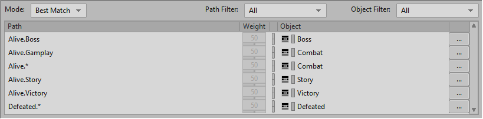

We have these different musical elements for different parts of the game. How do we transition between them for different game states?

## Configuring a Music Switch Container

Do do this we'll add all of our playlists to a "Music Switch Container" and call it "Wwise 201 Music". This container has its own tempo. Because of this you need to override the parent for all the playlists, so they keep their correct tempo.

Go to the Music event and replace the target with the new "Wwise 201 Music" switch container. You won't be able to hear anything just yet.

Pin the Transport to the Music event and continue.

## Using a State with Transitions

In order to tell Wwise which music to play we have to use states. We can assign states in the "Music Switch Container Association Editor". Go there and add the state group "PlayerLife".

Drag Combat to Alive and Defeated to Defeated. Go to the Transport and select either state from PlayerLife to test.

## Adjusting the Default Transition Rule

We'll now define how we transition between musical cues. Select the transitions tab and select the any to any transition. Change the exit source to "next bar" and test your transition.

Let's add another transition so that when we're defeated it immediately transitions to the defeated sounds. Drag the Defeated playlist into the 2nd transition destination and change the exit source to "immediate". Create another transition and add Defeated to the 3rd transition source.

The point of this is to let the defeated cue run until its done before starting the combat cue up again. This breaks the transition to defeated for me. See if you can figure out how to fix it.

## Creating Customized State Groups for Transitions

Create a new Default Work Unit in the States folder of the Game Sync tab called Music. Make a state group in Music called "Music_State". Create states for Gameplay, Boss, Story, and Victory.

Select the Wwise 201 Music Music Switch Container. Add the "Music_State" group right next to the PlayerAlive group. Because there are multiple states possible, you can't just drag in playlist containers to the states.

Select Alive and Boss then click "Add Path(s)". See how "Alive.Boss" just showed up in the list below? We can add our Boss playlist to this path now. You can do this faster by selecting the Music_State then dragging the playlist container onto it.

Your final playlist should look like this:

Test by playing the Music event and changing the states you just added. Again, mine is waiting until the end of the cue, not the bar. What's happening??

To actually get the game engine to trigger our changes we have to add more events that the game engine is calling for. Let's create a "Boss_Start" event in the Music work unit. Add a state event here with a type of "set state". Set the target to the boss music state by right clicking. Create an Event named Map_Completed and use it to set the Music_State to Victory.

On the Music event add another set state and set the target to "Gameplay". Make sure this one is first. Add an stop event to stop the "Wwise 201" music and put that before the set state event.

Add these new events to the soundcaster to test out.

Add the events to the music soundbank and test the game.
