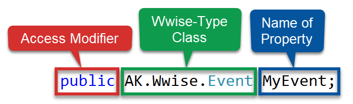

# Posting Events from a Script

This involves using Unity scripting to run your events, giving you more control over how things are triggered.

# Posting Events using Wwise-Types

## Creating a Wwise-Type Event property

Open the "Posting Events using Wwise-Types" lesson in the Wwise project. We'll make a script that has a Wwise-Type Event class variable.

Create a new script on the Player game object called "PostWwiseEvent". Double-click the script to open it in Visual Studio.

Unity has created the following script to get you started:

```c#
using System.Collections;
using System.Collections.Generic;
using UnityEngine;

public class PostWwiseEvent : MonoBehaviour {

    // Use this for initialization.
    void Start () {

    }

    // Update is called once per frame.
    void Update () {

    }
}
```

We can break down the script into parts:

- Namespaces
  - Import code from C# and Unity to make writing scripts easier
- The Class
  - Allows use of Unity specific code. Everything you write will be included between the curly braces of the Class. Notice that the class name matches the name of the script.
- Functions


We'll be adding this line to our script:



Add this inside the class but above the start function. Save the script and return to Unity.

## Assigning and Posting a Wwise-Type Event

# Posting Events from Animations

# Posting Audio Input

# Reference Scripts

## Assigning and Posting a Wwise-Type Event: PostWwiseEvent

## Posting Events from Animations: PostWwiseEvent
